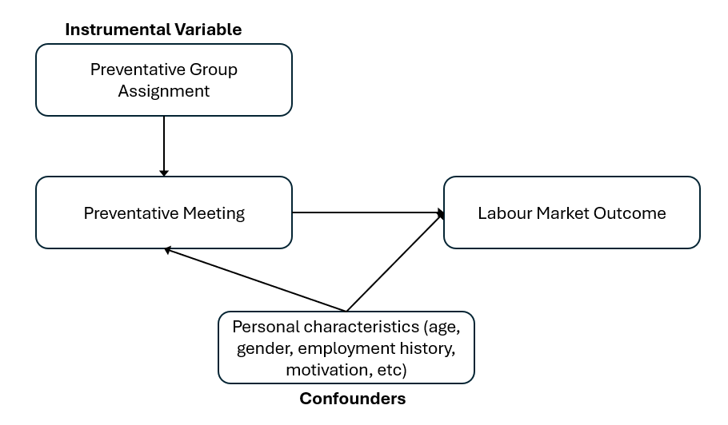
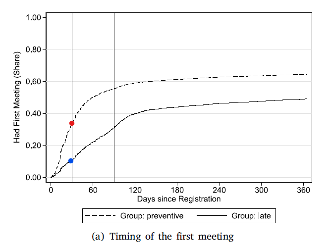
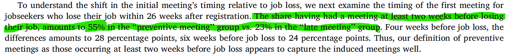
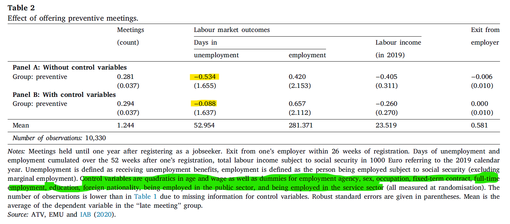
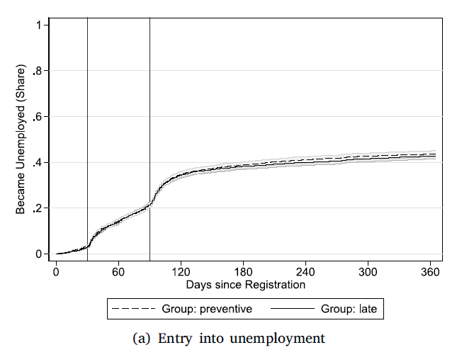
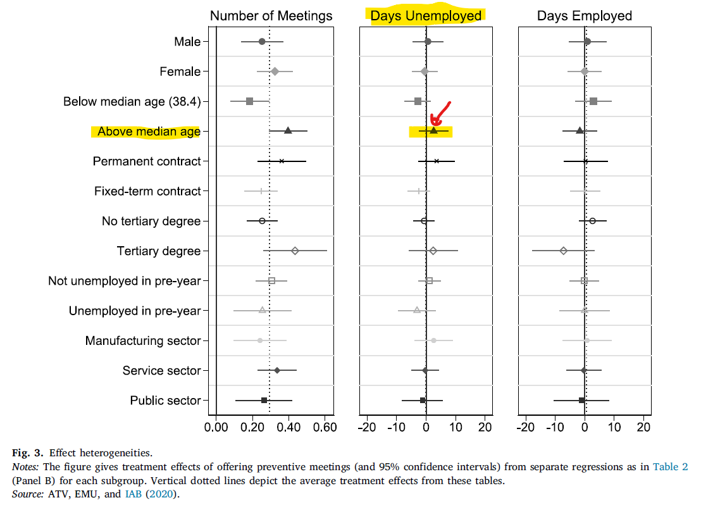
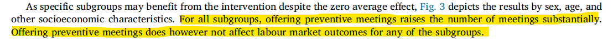

```{r setup, include = FALSE}
knitr::opts_chunk$set(echo = FALSE)

library(webexercises)
```

```{r, echo = FALSE, results='asis'}
# Uncomment to change widget colours:
#style_widgets(incorrect = "goldenrod", correct = "purple", highlight = "firebrick")
```


## Overview

This document uses the following paper

Homrighausen, P., Oberfichtner, M., (2026) Do caseworker meetings prevent unemployment? Evidence from a field experiment. European economic review, 2026-03, Vol.183, p.105215, Article 105215

to discuss how Randomised Control Trials (RCTs) are used in combination with instrumental variables to make causal inference statements.


## Paper Context

Homrighausen and Oberfichtner (2026) examine whether the period of unemployment can be reduced through caseworker meetings. The particular question addressed here is whether such meetings, which in the literature have been found to be helpful for people in unemployment, can be helpful for workers even before their unemployment has started, in particular workers who are still in employment but have already been notified that they will be losing their job shortly. These meetings are called preventive meetings in the context of the paper.

The authors establish that such meetings are not effective.

## Subjects and institutional context

The subjects in the study are 10,500 workers. These were all employees (in four German regions) who met the following requirements:

* contacted the job center at least one month before the end of their employment
* contacted the job center either by phone or online (but **not** in person)

These, as well as the employees who get in touch with the job center in person (but are not part of the experimental group) are entitled to a meeting with a caseworker, even before their current employment ends. In the context of the paper these people are called jobseekers.

The jobseekers who were part of the experiment were then randomised into two groups:

* Treatment Group ("Preventative Meeting"): At the time of first contact/registering their impending unemployment a caseworker meeting was scheduled.
* Control Group ("Late Meeting"): At the time of first contact/registering their impending unemployment the jobseeker was told that a caseworker meeting would be scheduled. The jobseeker's details were then passed on to the caseworker who would then arrange a meeting.

The aim of the treatment is to schedule the first caseworker meeting as early as possible and certainly before the actual start of the unemployment. In other words the treatment is a matter of the timing of the meeting, not whether the meeting actually takes place or what was done in the meeting. But it may not only move the first meeting forward, it may also result in the jobseeker having more overall meetings with the caseworker than without the intervention.


::: {.callout-note}

#### Question 

Allocate the following cases to one of the following groups: Experiment - Treatment, Experiment - Control, non-Experiment or Unclear

* John, calling a job center 40 days before unemployment starts. A caseworker meeting is being scheduled during that call. `r mcq(c(answer = "Experiment - Treatment", "Experiment - Control", "non-Experiment",  "Unclear"))`
* Yuanyuan, calling a job center 20 days before unemployment starts. A caseworker meeting is being scheduled during that call. `r mcq(c("Experiment - Treatment", "Experiment - Control", answer = "non-Experiment",  "Unclear"))`
* Sean, registering as a jobseeker online 35 days before unemployment starts. `r mcq(c("Experiment - Treatment", "Experiment - Control", "non-Experiment",  answer = "Unclear"))`
* Miranda, registering as a jobseeker online 15 days before unemployment starts. `r mcq(c("Experiment - Treatment", "Experiment - Control", answer = "non-Experiment",  "Unclear"))`
* Jessica, registering as a jobseeker 45 days before unemployment starts by calling a job centre. Her details are being passed on to a caseworker so that the caseworker can schedule a meeting. `r mcq(c("Experiment - Treatment", answer = "Experiment - Control", "non-Experiment",  "Unclear"))`
* George, registering as a jobseeker 45 days before unemployment starts by coming in-person to a job centre. He is immediately seen by a caseworker for a first meeting. `r mcq(c("Experiment - Treatment", "Experiment - Control", answer = "non-Experiment",  "Unclear"))`


`r hide("Answer")`

Why is Sean's status not clear? On page 4 it is described how, if someone is randomised into the Traeatment group, a call centres worker will schedule a meeting for the jobseeker with a caseworker. It remains unclear from the discussion in the paper how that would happen if someone was to register online, which presumably does not involve an immediate contact with a call centre worker. It is, of course, possible that the online platform would automatically schedule a meeting. But the discussion does not clarify this.

The discussion is, however, clear in saying that such jobseekers are part of the experiment, it is just not clear how they would enter the treatment group. So really the answer should be that Sean is member of the experimental group and not enough information is given to decide whether Sean was in the treatment or control group.

`r unhide()`

:::


::: {.callout-note}

#### Question 

Why were jobseekers registering in person not included into the experiment?

`r hide("Answer")`

Jobseekers registering in person may have a more positive view of the usefulness of meeting a caseworker. This different attitude may matter for later outcomes. Also, a jobseeker registering in person, may actually have direct access to a caseworker, such that it is not possible to include them into the experiment which basically randomises the timing of that initial caseworker meeting.

`r unhide()`

:::

## The Method - Why randomisation

At this stage we understand that the timing of the meeting is the margin the usefulness of which is being investigated here. You may therefore wonder why the authors are not merely attempting to figure out whether jobseekers who have earlier meetings have better job market outcomes, say 3 months after the end of their current employment.

For instance, could we run a regression which looks something like this

\begin{equation*}

outcome_i = \alpha + \delta ~timing_i + u_i

\end{equation*}

where $outcome_i$ is a measure of the labour market outcome we are interested in for person $i$, say, whether you are employed 3 months after the end of the initial employment, or your weekly income 3 months after the end of the initial employment. And $timing_i$ is the timing of the initial caseworker meeting. For instance $timing_i = -20$ if the the first meeting took place 20 days before the end of your employment or $timing_i = 5$ if the the first meeting took place 5 days after the end of your employment. If having earlier caseworker meetings worked we would expect the coefficient $\delta$ to be negative. Smaller values of $timing_i$ should be associated with better/higher labour market outcomes.

If you had data for these two variables you could easily run such a regression and you may well get a negative coefficient estimate for $\delta$ ($\hat{\delta} < 0$). But at that stage this will only give you a measure of correlation between the two variables, and of course "correlation is not the same as causation".

Econometricians will tell you that the $\delta$ above can only be interpreted as a causal effect if $timing_i$ is an exogenous variable. What does that mean? Let us first answer a few question.


::: {.callout-note}

#### Question 

Abstract from the above experiment, or think about areas where the experiment did not take place.

Jobseekers with better skills are likely to have earlier caseworker meetings. `r torf(TRUE)`

Jobseekers with more motivation to find a new job are likely to have earlier caseworker meetings. `r torf(TRUE)`

Jobseekers with more education are likely to have earlier caseworker meetings. `r torf(TRUE)`

`r hide("Explanation")`

One may argue about any of the individual answers above. What is undisputed is that any of the above three variables (skill, education and motivation) typically have positive impact on job market outcomes ($outcome_i$). That means that in terms of the above equation they are really missing as explanatory variables on the right hand side of the equation and therefore their effects are captured by the error term $u_i$. Such variables are sometimes called omitted relevant varaible.  

Whether they are also related to the timing of the meeting is very much debatable, but it is certainly possible. If they are (or at least one of them) then our explanatory variable $timing_i$ is correlated with the error term and then we call the explanatory variable **endogenous**. And the coefficient to an endogenous variable cannot be interpreted as a causal effect. Technically it will be estimated with (omitted variable) bias.

Those familiar with regression analysis, may argue that we could of course control for these other variables (sometimes called confounders). And that is correct, the problem being that often we are unable to do so. Amongst the above variables it may be possible to obtain information that captures the education level of person $i$ but skill levels are already quite tricky and information on motivation is certainly, even conceptually, difficult to obtain.

`r unhide()`

:::

The takeaway from this little thought experiment is that, in order to make a causal statement, we need variation in the explanatory variable (here $timing_i$) that is exogenous, i.e. unrelated to anything we have left in the error term. The key here is that we do not need all variation in $timing_i$ to be uncorrelated with the error term $u_i$.

And that is what the randomisation into the the two groups will do. This will not explain all of the variation in the timing of the meeting, but, the hope is that it will explain some of the variation in the timing variable **and importantly** we have a variable that explains that part of the variation (whether a person is member of the control or treatment group).

## The Method - The big picture

Let's return to the earlier equation 

\begin{equation*}

outcome_i = \alpha + \delta ~timing_i + u_i

\end{equation*}

As we discussed above there is a lot of relevant variation left in the error term. We said that some of that could be catered for by including the variables into the regression (say, education, gender, age etc.). We add these variables (collected in $\mathbf{x}_i$) to our model.

\begin{equation*}

outcome_i = \alpha + \delta ~timing_i + \mathbf{x}'_i ~ \mathbf{\beta} + v_i

\end{equation*}

But we need to recognise that it is unlikely that these variables will capture all relevant variables that were in the original error $u_i$. Some relevant variables, like a jobseeker's motivation, are inherently unobservable and therefore cannot be included.


`r hide("How did you get this new term?")`

In any example we may want to add a whole lot of variables and to avoid having to write down a very long equation, the trick is to collect all such confounder variables into a vector and then just add that vector. If that techniques is unfamiliar to you, we will explain this here.

To illustrate let's add three variables, but it is important to understand that these could be 27 variables or any other number.

\begin{equation*}

outcome_i = \alpha + \delta ~timing_i + \beta_1 ~age_i + \beta_2 ~ education_i + \beta_3 ~ gender_i + u_i

\end{equation*}

Let's continue by collecting such variables in a vector of variables.

\begin{equation*}

\mathbf{x}_i = \left(\begin{array}{c}age_i\\ education_i\\ gender_i\end{array} \right)

\end{equation*}

and the coefficients into a vector of coefficients

\begin{equation*}

\mathbf{\beta} = \left(\begin{array}{c}\beta_1\\ \beta_2\\ \beta_3\end{array} \right)

\end{equation*}

If you know vector/matrix algebra, then you can confirm that

\begin{equation*}

\mathbf{x}'_i \mathbf{\beta} = \beta_1 ~age_i + \beta_2 ~ education_i + \beta_3 ~ gender_i 

\end{equation*}

and therefore we can re-write the equation as

\begin{equation*}

outcome_i = \alpha + \delta ~timing_i + \mathbf{x}'_i ~ \mathbf{\beta} + v_i

\end{equation*}


`r unhide()`

At this stage we should expect that the $timing_i$ variable is still correlated with some variables unobserved but relevant variables that are captured in the error term $v_i$. So, despite moving some confounders from the old error term $u_i$ into the explained part of the equation we would still have to consider $timing_i$ to be endogenous. 

The authors simplify the $timing_i$ variable into a binary variable which captures whether a jobseeker had an early first caseworker meeting, $preventative~meeting_i$ which takes the value 1 for all jobseekers who have such a meeting at least two weeks before they loose their job.

\begin{equation*}

outcome_i = \alpha + \delta ~preventative~meeting_i + \mathbf{x}'_i ~ \mathbf{\beta} + v_i

\end{equation*}

This is equivalent to equation (4) in the paper. $preventative~meeting_i$ is still a potentially endogenous variable as it may still be related to the error term $v_i$, meaning that some variation in $preventative~meeting_i$ is likely to be correlated to omitted variables.

However, the key purpose of the experiment was to generate some variation in $preventative~meeting_i$ that is exogenous as it is due to a randomisation. The key of the method is to use that part of the variation in $preventative~meeting_i$.

In other words we use the random assignment $preventative~group_i$ variable( which is equal to 1 if a jobseeker is part of the experimental treatment group, and 0 otherwise) as an instrumental variable. 

The assumption we are making here is that the random assignment does not have any direct impact on labour market outcomes and only operates on labour market outcomes through its impact on potentially earlier caseworker meetings. We use an instrumental variable to isolate exogenous variation in the variable of interest, here $preventative~meeting_i$.

Instrumental variables are variables that only influence the outcome variable indirectly via the variable of interest (here $preventative~meeting_i$). The difficulty with such variables is usually the need to argue that this indirect influence is the only way in which this instrumental variable impacts on the Labour Market outcomes.



On this occasion, as the assignment to the treatment group (preventative meeting) is random this is somewhat easier, as the only thing triggered by the assignment is the early scheduling of a caseworker meeting. 

Conceptually there are now three things to check

1. Did the randomisation split the experimental group into two comparable groups?
2. Did the randomisation actually generate variation in the explanatory variable?
3. Did the randomisation result in different outcomes between to the two groups?

Only if 1. can be confirmed can we attribute variation in 2. to the randomisation. If we can do that, then we know that exogenous variation in $timing_i$ was created. If then differences in the outcome can be established, then we know that a) they do not come from unobserved variation, as we randomised the group membership and there is no reason why any other relevant factors should be distributed differently between the two groups. This leaves b) the exogenous variation we created in the explanatory variable ($timing_i$) as the only plausible reason for the variation in outcomes.


## The Method - Test that randomisation worked

It is conventional in papers that use a randomisation setup to begin with confirming that the randomisation did indeed achieve objective 1, the creation of two comparable groups. Here we share an extract of Table 1 in the paper.


In the rows you can see a variety of characteristics for jobseekers (age, gender, education, nationality, etc). In the columns you can see the average value for these characteristics in different groups. Here you can see in the last two columns how these characteristics compare between the two experimental groups, the treatment group ("preventive") and the control group ("late"). When comparing the average characteristics you can see that they are very comparable to each other. For example, there are 55% females in the treatment group and 54% females in the control group. Values in parenthesis are standard deviations.

::: {.callout-note}

#### Question 

Confirm from Table 1, Which of the following variables do not displays significant differences between the experimental treatment and control groups. (multiple correct answers possible)

```{r}
opts_p <- c( answer = "Fixed-term contract (initially)",
   answer = "Full-time worker",
   answer = "Monthly gross wage",
   answer = "Employed by temporary agency"
)
```

`r longmcq(opts_p)`

`r hide("Explanation")`

None of the four variables listed above and indeed none of the variables reported in Table 1 show any significant differences between the two experimental groups. 

Often you will find authors actually reporting p-values for statistical tests that test the null hypothesis that a particular average characteristic is the same against the alternative that they are different on average between the two groups. If so, small p-values indicate more evidence against the null hypothesis. Here the authors report the p-value for such a test that tests the null hypothesis that all characteristics are the same in both groups against the alternative that at least one chgaaracteristic is different between the groups. They report a p-value of 0.55.

`r unhide()`

:::


::: {.callout-important}

#### Interpreting p-values 

P-values appear frequently in empirical papers. They are easily misinterpreted. Let's take the above example of the authors testing that the mean ($\mu$) of all characteristics are identical between the two experimental groups (treatment - $t$ and control - $c$).

A p-value of 0.55 indicates that, assuming that there are no differences in the characteristics between treatment and control group in the population, there is a probability of 55% that we get the type of differences between the sample groups (or more extreme differences). This is a pretty large probability which implies that the sample data are consistent with the null hypothesis being correct.

More generically, p-values are "the probability of obtaining the sample result - or one more extreme - if the null hypothesis was true". This is a slightly awkward interpretation. We would truly like to have "the probability that the null hypothesis is true". However, that latter assumption is only obtainable with Bayesian methods which require additional assumptions.

`r hide("Extended Explanation")`

A formal way to express the null hypothesis is:

\begin{equation*}
  H_0: \mu_{age}^t = \mu_{age}^c, \mu_{female}^t = \mu_{female}^c, ..., \mu_{unemp\_26weeks}^t = \mu_{unemp\_26weeks}^c 
\end{equation*}

When testing it is importing to clearly understand the null hypothesis, but also know what the alternative hypothesis is we are testing for. It is basically the opposite of the null hypothesis which here implies:

\begin{equation*}
  H_A: \mu_{age}^t \neq \mu_{age}^c~and/or~ \mu_{female}^t \neq \mu_{female}^c~and/or~ ...~and/or~ \mu_{unemp\_26weeks}^t \neq \mu_{unemp\_26weeks}^c 
\end{equation*}

In words, the alternative hypothesis is correct if any one (or more than one) of the characteristice show differences. The authors report a p-value of 0.55. How should that be interpreted? 

Note that in Table 1 when comparing the two last columns you can see differences. Are these differences big or small taking into account that we are looking at a sample of data but we are really interested in the population. The p-value is one way to instrumentalise small or big. 

**Assume** for the moment that $H_0$ is correct. So all characteristics are identical in the population. Then we randomly draw a random sample (of the same size as we have it here). In the randomly drawn samples there will be differences. If the p-value, like here is 0.55 that implies that the researchers conclude that there is a 55% probability that the differences in that randomly drawn sample are at least as big as the ones they can see in the actual data. As 55% is a pretty substantial probability the conclusion is that the data are consistent with the null hypothesis. The lower the p-value the less we think that the data are consistent with the null hypothesis.

It is convention to reject the null hypothesis when the p-value slips below certain threshold levels, typically 0.1, 0.05 or 0.01. That threshold reflects the probability with which you accept that you will reject a correct null hypothesis, we call this the significance level.

`r unhide()`
  
:::

All in all we can conclude that the randomisation did work.

If you re-inspect Table 1, you way wonder what we can learn from the first three columns in which the average values for the characteristic for all jobseekers in Germany (col 1), all jobseekers in the investigated regions (col 2) and all jobseekers who are part of the experiment are reported. Here you can see some differences between the columns. For instance you can see that 22% of jobseekers in the experiment have a level of tertiary education, that is larger than the proportion of all jobseekers in the region with that level of education (only 15%) or in Germany (16%).

Why is this important?

It is important to recognise that we are not only interested in the effect of the intervention for the people in the particular experiment, but we are interested in the potential effect of the intervention in, for instance, the entirety of Germany. Now that we see differences between the group of people in the experiment and the broader groups we will have to wonder whether such differences may mean that the conclusions drawn from this study can be transferred to the broader population. This is called external validity. More on that later.

::: {.callout-note}

#### Question 

Confirm from Table 1, Which of the following variables displays significant differences between the experimental group and the population of jobseekers in Germany. (multiple correct answers possible)

```{r}
opts_p <- c( answer = "Fixed-term contract (initially)",
   "Full-time worker",
   answer = "Monthly gross wage",
   answer = "Employed by temporary agency"
)
```

`r longmcq(opts_p)`

`r hide("Explanation")`

Without presenting actual hypothesis tests it is not so straightforward to evaluate whether particular differences are statistically significant. Therefore you may dispute whether the above indicated answers are correct. But it is obvious that there are some characteristics in which the experimental group differs from the population.

`r unhide()`

:::

The authors conclude at to top of page 6:

> "We thus think of our experimental sample as jobseekers who do not have worse labour market outcomes than the average jobseekers, but are more used to employment uncertainty and contact with the employment agency."

They recognise that there are some systematic differences between their experimental group and the broader population of jobseekers.

## The Method - Testing for exogenous variation

This is where we are to test that indeed the randomisation created variation in the timing or here the $preventative~meeting_i$ variable (Section "5. Effects of offering preventive meetings" in the paper). The authors do that in two ways. Let's first look at the graphical method they apply. 



You can see from this graph that the experimental group has their first meeting with a caseworker quicker, about 35% have their first meeting with a caseworker within 30 days of registration (red dot) while in the control group only about 12% of all jobseekers have their first meeting within 30 days (blue dot). Recall, that we previously established that the two groups are comparable in all aspects other than experimental group membership. This means that we can be confident that this variation is exogenous.

The above variable is not exactly the same as $preventative~meeting_i$ variable (meeting at least 20 days before unemployment), but there is certainly a plausible relation. Note that not all jobseekers have such a first meeting. The reason being that some jobseekers never go into unemployment, either current employment gets extended or they find new employment before their initial employment ends.

Therefore the authors restrict much of the following analysis to jobseekers who actually become unemployed within 26 weeks of their registration. Without such unemployment the $preventative~meeting_i$ variable is not defined.

The second method tests the relationship between $preventative~meeting_i$ and $preventative~group_i$ where the letter is 1 for all jobseekers that are member of the treatment group and 0 otherwise. The relationship between these two variables is established with the following regression (equation 5 in the paper).

\begin{equation*}

preventative~meeting_i = \alpha^f + \delta^f ~preventative~group_i + \mathbf{x}'_i ~ \mathbf{\beta}^f + v_i^f

\end{equation*}

In the context of instrumental variables estimation this is usually called the first stage regression (and therefore the $f$ superscripts for the coefficients). If we find the coefficient $\delta^f$ to be statistically significant (here positive as being in the treatment group would make it more likely for a jobseeker to have an early meeting) then we have established that there is exogenous variation in $preventative~meeting_i$.

The authors never actually report the results of this first stage regression, however, at the bottom of page 



This implies that the estimate for $\delta^f$ is about ($0.55 - 0.23 = 0.22$).

With this evidence, the authors established that

1. Randomisation did split the experimental group into two comparable groups?
2. Randomisation did generate variation in the explanatory variable?

They are left to establish whether

3. the randomisation resulted in different outcomes between to the two groups?

## The Method - Impact on outcome variables

Evidence whether variation in the explanatory variable $preventative~meeting_i$ (or more generally $timing_i$) had an impact on labour market outcomes is obtained by running regressions like the following (equivalent to equation 1 in the paper):


\begin{equation*}

outcome_i = \alpha + \delta ~preventative~group_i + \mathbf{x}'_i ~ \mathbf{\beta} + v_i

\end{equation*}

As you can see, the variable $preventative~meeting_i$ actually does not appear, but rather the variable $preventative~group_i$ which is the cause for the exogenous variation in $preventative~meeting_i$. This is called the reduced form regression. The results are reported in Table 2.



Across the columns you can see different outcome variables $y_i$ (Meetings, Labour market outcomes and employer exit). Then there are two rows (Panel A and B) where Panel A does not include any control variables ($\mathbf{x}'_i$) but Panel B does (see the green highlighted section in the Table notes for a list of the variables included for the results in Panel B). The yellow highlighted coefficient estimates are estimates of $\delta$. For instance $\hat{\delta}= -0.088$ for days in employment as the outcome variable and for the estimation with control variables. This is a negative impact, but it is very small and when calculating a t-test for testing the null hypothesis that $\delta = 0$ we get $t-stat = (-0.088 - 0)/1.637 = -0.0538$ which is very small (at a 5% significance level we would reject $H_0$ if $|t-stat| > 1.96$). The p-value for that test is 0.96 which implies that there is basically very little evidence against the null hypothesis that $\delta = 0$ or that there is no effect on the days in unemployment.

::: {.callout-note}

#### Question 

Looking at the column for Labour Income in Table 2 (Panel B). Which of the following is correct?

```{r}
opts_p <- c(
   "The p-value for testing that there is no impatc on the labour income is 0.270 and therefore we conclude that there is a statistically significant effect of the early meeting.",
   answer = "The t-test for testing that there is no impact on the labour income is -1.302 (p-value = 0.34) and therefore we conclude that there is no statistically significant effect of the early meeting."
)
```

`r longmcq(opts_p)`


`r hide("Answer")`

To calculate the t-test for testing $H_o:\delta = 0$ against $H_o:\delta = 0$ we calculate

\begin{equation*}
  t-test = \frac{\hat{\delta}-0}{se_{\hat{\delta}}}= \frac{-0.260}{0.270}=-0.9630
\end{equation*}

The p-value for this test is (without details of calculation), 0.3356. At any standard significance levels (like 1, 5 or 10%) we will not reject the null hypothesis as the p-value is larger than the significance level.

`r unhide()`


:::

Overall the authors conclude that despite the intervention resulting in earliera and more caseworker meetings this seems to have no clear impact on labour market outcomes. These results are confirmed by the temporal evolution of labour market outcomes across the treatment and control group. Panel (a) of Figure 2 reveals that the proportion of jobseekers actually becoming unemployed is virtually indistinguisable across the 360 days from registering as a jobseeker. This is not surprising given the random assignment to the two groups, and acknowledging the ineffectiveness of the intervention.



## Effect heterogeneity

The jobseekers included into this experiment have a lot of different personal charecteristics (gender, age, education, employment history). It is conceivable that the intervention may have very different effects on different subgroups of the experiment population. This is a question that is always worth asking whether the overall analysis has shown effects or not. 

To investigate this, the above analysis can be repeated for particular subgroups of the sample only. Let's consider the subgroup of jobseekers that is older than the median age. By definition this reduces the sample size from 10,330 to 5,165. We should therefore expect that these results are estimated with a larger degree of uncertainty.


From the above Figure you can see (yellow highlights) that the intervention effect for this subgroup is estimated slightly positive (triangle). However the 95% confidence interval is wide and encloses the 0 line. This means that we have no strong confidence that the real population effect is actually positive as well. From the width of the confidence interval (eye-balling it to have a width of about 10) we can also see the increased uncertainty relative to the full sample result where the 95% confidence interval is only about 6 units wide.


::: {.callout-important}

#### Interpreting confidence intervals 

As discussed earlier, p-values have a slightly awkward interpretation ("The probability of obtaining the sample result - or one more extreme - if the null hypothesis was true"). 

Confidence intervals are an alternative way to capture the uncertainty encapsulated in say regression estimation results. Confidence intervals provide a range of plausible values for a population parameter (like the coefficient $\delta$) based on sample of data. 

In Figure 3 the sample estimate $\hat{\delta}$ for the above median age group for the regresison on days of unemployment, was approximately 2 (eye-balled) and the 95% confidence interval reached from approximately -3 to 7. So how is that to be interpreted? Could we say that there is a 95% probability that the true (but unknown) population coefficient $\delta$ takes a value between -3 and 7? Unfortunately that is not the correct interpretation.

The correct interpretation is that if we were to repeat the sampling, say, 100 times and we everytime calculated the 95% confidence interval in the same way, we should expect 95 of the 100 resulting confidence intervals (each of tem with different lower and upper bounds) to include the unknown population value of $\delta$. As you can see, the bounds of our initial confidence interval (-3 and 7) play no role in this interpretation.

Despite this awkward interpretation confidence intervals can be the basis for useful graphical representations of the uncertainty we should acknowledge comes with regression results. 

:::

Looking at the broader results in Figure 3 the authors conclude



## The conclusion

The authors go through some extra analysis that is geared to help judging whether the results can be interpreted outside of the particular sample used in this experiment. Survey evidence is used to supplement their finding leading them to the conslusion that early meetings (while still employed) do not result in increased job seekeing activity.

They conclude that there is the possibility that caseworker meetings may prove more effective for jobseekers that register in person at job centers.

Interpreting their results in the context of previous findings that caseworker meetings with unemployed are very effective (as opposed to still employed jobseekers covered in this paper), they conclude that interventions that move such meetings to be preventative is not cost efficient.


## Further things to think about

* effect heterogeneity
* external validity
* pre-registration


