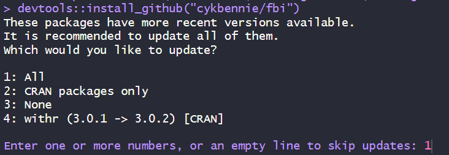

```{r setup, include=FALSE}
knitr::opts_chunk$set(echo = TRUE, warning = FALSE, message = FALSE)
```


## Introduction

Empirical Macroeconomic research depends on the availability of time-series data for macroeconomic variables. Collating the data and potentially making them comparable to other previously published work can be very burdensome. In order to make this process easier and to make work more comparable, Michael McCracken and Serena Ng collaborated with the St Louis FED who maintains the [FRED database](https://fred.stlouisfed.org/) in order to create a standard Macro dataset for the U.S. You can read in detail about this dataset [here](https://research.stlouisfed.org/wp/more/2015-012).

Here we will show how to access and use these data. The workthrough here is largely based on the example presented in [Yankang Chen's vignette](https://github.com/cykbennie/fbi) to the `fbi` package.

After importing and preparing the data we will apply a factor estimation to the dataset. As you will see there are more than 120 variables in the dataset. Many of these variables will be highly correlated with each other and potentially represent very similar information. For many economic applications it may be advantageous to extract a smaller number of factors from this large dataset. It is the process of extracting such factors which will be demonstrated below.

## Prepare your workfile

Ensure that your working directory is set correctly.

```{r, eval = FALSE}
setwd("YOUR/WORKING/DIRECTORY")
```

We will also use a standard set of libraries.

```{r}
library(tidyverse)
library(ggplot2)
```

## Data upload

There are two ways in which you could upload the FRED-MD dataset. YOu can either download the current (or indeed a past version) of the FRED-MD database from [Michael McCracken's FRED website](https://research.stlouisfed.org/econ/mccracken/fred-databases/), or you could use a R package that was designed to directly access the data. The package is called `fbi` and is writtenby Yankang Chen. This is a package that is not available from the CRAN webpage from which you can download most R packages. It is available from the [author's Github page](https://github.com/cykbennie/fbi). If you go to that page and read the `README` section you will find the instructions. Here the package'sauthor tells you that you should ensure that you already have the `stats`, `readr` and `pracma` installed. So please go ahead and check that you have these, and if not please install these packages via the normal way.

Then you can install the package directly from the Github page using the `install_github` function from the `devtools` package (which is a package you also need to have installed). As usual, this only needs to be done once on your computer.

```{r, eval = FALSE}
devtools::install_github("cykbennie/fbi")
```

When I installed this I got the following message



I answered "1" and the package installed fully.

Let's use the `fbi` package to import the data. We first need to point the code at the right place of storage for the dataset (`filepath`). 

```{r}
library(fbi)

filepath <- "https://files.stlouisfed.org/files/htdocs/fred-md/monthly/current.csv"
data.md <- fredmd(filepath, date_start = NULL, date_end = NULL, transform = TRUE)
```

In your environment you will have an object `data.md`. The file was stored at "https://files.stlouisfed.org/files/htdocs/fred-md/monthly/current.csv". The filename "current.csv" will always have the most current version. But you can get timed snapshots. We will reload the data using the dataset fixed in September 2024.

```{r}
filepath <- "https://files.stlouisfed.org/files/htdocs/fred-md/monthly/2024-09.csv"
data.md <- fredmd(filepath, date_start = NULL, date_end = NULL, transform = TRUE)
data.md.0 <- fredmd(filepath, date_start = NULL, date_end = NULL, transform = FALSE)
names(data.md)
```

We will continue to use this timed version to ensure that the following results do not change as the data are updated.

The `fredmd` function has a number of input options

* `date_start`, if `= NULL` then uses the earliest available data, if you want to begin at a certain date set, e.g. `date_start = as.Date("2020-01-01")`.
* `date_end`, if `= NULL` then uses the latest available data, if you want to and at a certain date set, e.g. `date_start = as.Date("2022-09-01")`.
* `transform`, if `= FALSE` then the original data, if `= TRUE` then transformed data, see details below.

It is important to understand the data structure. Fortunately the `fbi` package has a useful function which allows you to access information on the variables in the dataset, including information on the transformations used if `transform = TRUE` is set. 

```{r}
var.info <-describe_md(names(data.md),name.only = FALSE)
head(var.info)
```

In `var.info` you can now find the descriptions of the data. Let's look at one of them

```{r}
var.info[var.info$fred == "VXOCLSx",]
```

> Note: The function `describe_md` will return variable information available in 2015-01. Some variables have changed and some have been added. You may have to refer to [this file](https://files.stlouisfed.org/files/htdocs/uploads/fredmdchanges0324.pdf) whichh tracks changes to the database. See example below.

Here you can see that the transformed version of the industrial production (`INDPRO`) series is the log difference. You may be interested in what type of different data transformations have been used here.

```{r}
unique(var.info$ttype)
```

As you can see some series are not transformed at all and then there are five different types of data transformations. Essentially the transformations are done to create stationary data-series. Let us illustrate this by displaying the untransformed `INDPRO` (from `data.md.0`) and the transformed series (from `data.md`).

```{r}
p1 <- ggplot(data.md.0, aes(x = date, y = INDPRO)) + 
  geom_line() +
  labs(title = "Industrial Production", y = "INDPRO")
p1
p2 <- ggplot(data.md, aes(x = date, y = INDPRO)) + 
  geom_line() +
  labs(title = "Industrial Production Growth", y = "delta(log(INDPRO))")
p2
```


## Data summary and preparation

You can look at data summaries using the standard `summary` function.

```{r}
var.info[var.info$fred == "FEDFUNDS",]
summary(data.md$FEDFUNDS)
```

Here you can see the summary info for the first difference of the Effective Federal Funds rate. You can also see that there is one missing observation. This is most likely the first observation which gets "lost" as a first difference was calculated.

Let's look at another series, the number of new private housing permits, `PERMIT`.

```{r}
var.info[var.info$fred == "PERMIT",]
summary(data.md$PERMIT)
```

Here you can see that there are 12 missing observations. Let's look at a plot of the data

```{r}
p3 <- ggplot(data.md, aes(x = date, y = PERMIT)) + 
  geom_line() +
  labs(title = "New private housing permits", y = "log(PERMIT)")
p3
```

You could investigate which observations are missing.

```{r}
data.md[is.na(data.md$PERMIT),c("date", "PERMIT")]
```

Clearly it is the 1959 data that are not available for this data series. In fact we can find out how many observations are missing altogether.

```{r}
sum(is.na(data.md))
```

If you read the paper describing the FRED-MD dataset you will find a discussion about outlier removal. The function that removes outlying observations (replacing them with `NA`) is called `rm_outliers.fredmd()`. We apply this to the `data_clean` dataset. Refer to the paper to see how exactly an outlier is identified. There are different ways to deal with outliers and in practical work you have to carefully think about this procedure.

```{r}
data.md.clean <- rm_outliers.fredmd(data.md)
```

As outliers are replaced by `NA` we can easily find out how many outliers were identified.

```{r}
sum(is.na(data.md.clean))-sum(is.na(data.md))
```

## Factor Model estimation

### Data matrix setup

Before applying a factor model we will have to think about how to deal with missing data. In the end we will want to use only observations that have data available for all variables. In `data.md.clean` we have 788 observations for 127 variables (but note that the first one is just a date variable and we will eventually not use it).

First, we will remove variables if they have too many missing values (recall that they could come from outliers being removed).

```{r}
col_na_prop <- apply(is.na(data.md.clean), 2, mean)
```

This basically identified the proportion of missing values. Recall that for all variables in which a growth rate was calculated we know that at least one observation (the first one) is missing. 

Let's see which variables have more than 5% of observations missing.

```{r}
col_na_prop[col_na_prop>0.05]
```

You can refer to the information in `var_info` to confirm that `ACOGNO` and `ANDENOx` relate to order information for consumer and capital good respectively. `UMCSENTx` is a consumer sentiment index. As it turns out, for the variables `TWEXAFEGSMTHx` and `VIXCLSx`we cannot find any information in `var.info`. These are variables that have been added to the database after 2015. We can find information on these variables from [this file](https://files.stlouisfed.org/files/htdocs/uploads/fredmdchanges0324.pdf). `VIXCLSx` is a measure of stock market volatility implied by option prices. The series `TWEXAFEGSMTHx` is new and has replaced another series which is also not included in `var.info`. In fact, the information in the file linked above is also not conclusive, but a web search for the variable id `TWEXAFEGSMTH` reveals that it is a "Nominal Advanced Foreign Economies U.S. Dollar Index". 

Let us now remove these five series from the dataset.

```{r}
data.md.select <- data.md.clean[, (col_na_prop < 0.05)]
```

The remaining variables will still have missing data. We shall now remove all rows of data (dates) in which we have any missing information.

```{r}
data.md.select.2 <- na.omit(data.md.select)
```

By comparing the number of rows of `data.md.select` and `data.md.select.2` you can identify that `nrow(data.md.select)-nrow(data.md.select.2)` = `r nrow(data.md.select)-nrow(data.md.select.2)` dates have been removed.

It may be good to know whether this removed mainly dispersed dates or a whole period. As we still have the date variable in both datasets we can compare the two sets of dates and identify which ones have disappeared.

```{r}
data.md.select$date[!(data.md.select$date %in% data.md.select.2$date)]
```

You can see that 12 of the dates arise from the entire year 1959 scratched. The only coherent period of missing data arose from March to July 2020 and basically the first half of 2021. This is likely related to some missing data from the Covid period.

In fact, for this exercis we will reduce the sample to include data until March 2014. This results in a data period which has also been used in the [McCracken and Ng (2016)](https://www.tandfonline.com/doi/full/10.1080/07350015.2015.1086655) paper intruducing the FRED-MD dataset.

```{r}
data.md.select.2 <- as.data.frame(data.md.select.2)
datesel <- (data.md.select.2$date < "2014-04-01")
data.md.select.2 <- data.md.select.2[datesel,]
```

We will continue working with the `data.md.select.2` dataset. But before proceeding we will remove the date variable as a variable but use the date information as row names.

```{r}
dates <- data.md.select.2$date
data.md.select.2 <- data.md.select.2[,2:ncol(data.md.select.2)]
rownames(data.md.select.2) <- dates
```

### Factor Model estimation

This is not the place where the theory behind factor models is to be explained. Here we will merely show how to implement factor estimation. The data we currently hold in `data.md.select.2` can be represented as the $(T \times N)$ matrix $\mathbf{X}$. The idea of a factor representation is that $\mathbf{X}$ can be decomposed into 

\begin{equation}
\mathbf{X} = \mathbf{F} \mathbf{\Lambda'} + e
\end{equation}

where $\mathbf{F}$ is a $(T \times r)$ matrix of common factors with $r\lt\lt N$. The $(N \times r)$ matrix of factor loadings, $\mathbf{\Lambda}$, describes how each of the $N$ variables in $\mathbf{X}$ is related to each of the $r$ factors in $\mathbf{F}$. The term $\mathbf{F} \mathbf{\Lambda'}$ delivers a $(T \times N)$ matrix of common components.

The error component $e$ is also a $(T \times N)$ matrix.

There are a number of key issues when estimating the factors. 

* What could be the variance covariance structure of the error components in $e$?
* How many factors ($r$) are required?

A good discussion is available from [Bai and Ng, 2019](https://doi.org/10.1016/j.jeconom.2019.04.021). The method proposed there is implemented through the `fbi` package we installed earlier.

```{r}
out <- rpca(data.md.select.2, kmax = 8, standardize = TRUE, tau = 0)
```

Here we implemented the factor estimation without rank regularisation of the common component (`tau = 0`), for standardised variables (meaning that all variables are scaled to have 0 mean and standard deviation 1) and for 8 factors.

### Investigating the factors

The output of the factor model estimation (`out`) saves a number of things, amongst others the estimated factors (`$Fhat`) and the factor loadings (`$Lamhat`). Let's look at the factors

```{r}
factors.est <- as.data.frame(out$Fhat) # extract factors and put in dataframe
factors.est$date <- dates               # add date variable

# create a long dataframe
factors.est <- factors.est %>% 
  pivot_longer(!date, names_to = "Factor", values_to = "Values")

# plot the time series for the extracted factors
ggplot(factors.est, aes(x=date, y = Values)) + 
  geom_line() + 
  facet_wrap(vars(Factor))
```

Let us see how the factors load on the different variables. As we are using standardised variables, looking at the coefficients in $\Lambda$ is informative.

```{r}
lambda.1 <- sort(out$Lamhat[,1])
lambda.1[1:10]
```

It is important to understand that the signs of the factor loadings do not have a useful interpretation. These are the 10 variables with the largest loadings on factor 1. This can be compared to those reported in McCracken and Ng (2016, Table 2). Of the ten variables loading highest (as reported in Table 2) seven appear on the above list. The three variables that are not identified here (`NAPM`, `NAPMNOI`, `NAPMPI`) are all variables that are no longer on the FRED-MD database ([see the change log for confirmation](https://files.stlouisfed.org/files/htdocs/uploads/fredmdchanges0324.pdf)).

## Reading

[McCracken, M. and Ng, S. (2016) FRED-MD: A Monthly Database for Macroeconomic Research, Journal of Business & Economic Statistics, 34, 574-589.](https://www.tandfonline.com/doi/full/10.1080/07350015.2015.1086655)

[Bai, J. and Ng, S. (2019), Rank regularized estimation of approximate factor models, Journal of Econometrics, 212, 78-96.](https://doi.org/10.1016/j.jeconom.2019.04.021)


