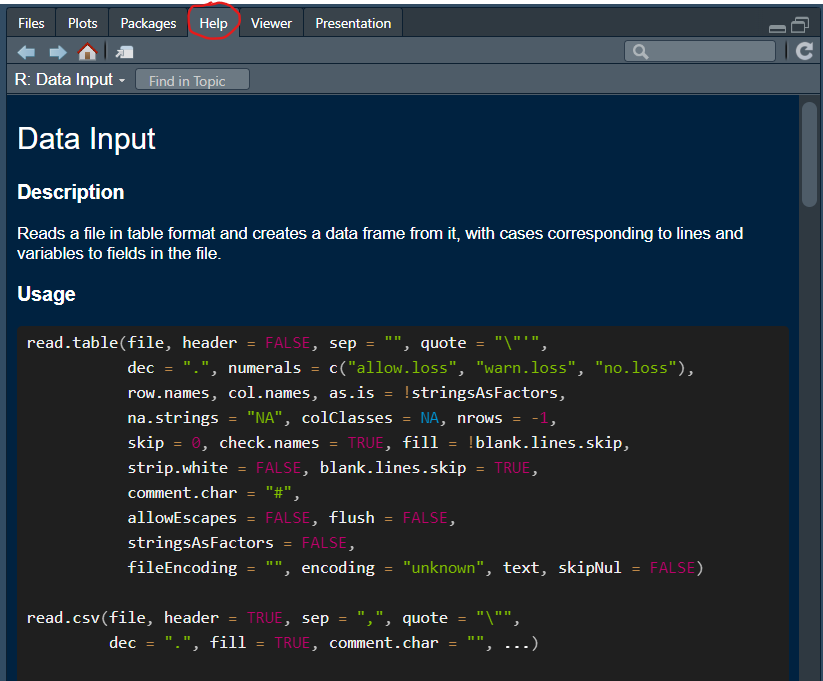
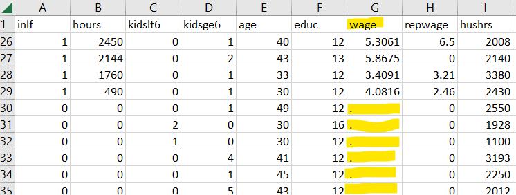

```{r setup, include=FALSE}
knitr::opts_chunk$set(echo = TRUE, warning = FALSE)
```

# Introduction

Here we will demonstrate how to load data into R. There are two ways to do this. Either you have data already in a file on your computer and then you load that file into R, or you directly link into a database from R. We will discuss both these techniques here.

# File upload

When you are working with an existing datafile on your computer, then you should first ensure that you have set your working directory such that it points to the folder from which you are working and where you can find your datafile. Let's assume that you have saved [mroz.csv](https://github.com/datasquad/ECLR/blob/gh-pages/data/Mroz.csv){target="_blank"} to your working directory: `C:\Rwork`. Then the command below should read `setwd("C:/Rwork")`. Note that all backward slashes (`\`) have to be replaced by forward slashes (`/`). 

```{r, eval = FALSE}
setwd("XXXX:/XXXX")   # replace the XXXX with your drive and path
```

The datafile we practice with here is a comma separated values file (csv). To upload such a file we use the `read.csv` function as follows, assuming that the data file is in the working directory:

```{r, eval = FALSE}
mydata <- read.csv("mroz.csv")
```
```{r, echo = FALSE}
mydata <- read.csv("data/Mroz.csv")
```


This loads the data (753 observations and 22 variables), as a new object called `mydata` into your environment. Check in your environment window to confirm that it is there. 

A typical erorr message at this stage is "Error in file(file, "rt") : cannot open the connection". If you get that error message this is an indicatin that the datafile you are intending to upload is not in the working directory. You can check what the current working directory is with `getwd()` in the console. Make sure that file location and working directory are synchronised.

If you use the help function (`?read.csv` in the console) you will find some guidance in the use of this function.

{width=50%}

As you can see there are a lot of options you can set. One which is often important to use is the `na.strings` option. Here you are telling R how missing values are coded up in the spreadsheet you are uploading.

Let's see why this is important. You can get a first glimpse at the data using the `str()` function. This is useful as it gives you the datatypes.

```{r}
str(mydata)
```

Most of the data are of the `num` (numeric) and `int` (integer) type, but two variables (`wage` and `lwage`) come as character/text (`chr`) variables. This is awkwar as we are likely to want to use these data (here wages) for some numerical analysis. Why did R not recognise these numbers as numbers?

To see that, here is an excerpt of the file we just uploaded:

{width=50%}

You can see that in the wage column there are some observations which do not have a number but rather a ".". This is this spreadsheet's way of telling you that for these observations there is no wage information. The information is missing. Different spreadsheets code missing values in different ways. Sometimes it will just be empty cells, sometimes it will say "NA" or "na". You need to help R to recognise missing values. That is what the `na.strings` option in the `read.csv` function does.

```{r, eval = FALSE}
mydata <- read.csv("mroz.csv", na.strings = ".")
```
```{r, echo = FALSE}
mydata <- read.csv("data/Mroz.csv", na.strings = ".")
```

You can now test with `str(mydata)` to confirm that the `wage` and `lwage` data are now recognised as numeric data.

If your data come as an excel file ([mroz.xlsx](https://datasquad.github.io/ECLR/Data/mroz.xlsx)), then we need to use a different function. There are, as always, different functions which do the same job. We recommend `read_excel` which comes from the `readxl` package (needs loading!). Note that the option to indicate how missing values are coded is here called `na`.


```{r, eval=FALSE}
library(readxl)
mydata <- read_excel("Mroz.xlsx", na = ".")
```
```{r, echo=FALSE}
library(readxl)
mydata <- read_excel("data/Mroz.xlsx", na = ".")
```

# Direct link to data databases

There are a number of packages which facilitate the easy download of data directly from your R code. These data are then not saved on your computer. This is very convenient, but does require that you have internet access when you work.

The ones we will discuss here are:

* Quantmod
* pdfetch


## Quantmod

A package that works well for downloading financial data is the `quantmod` package. 

```{r}
library(quantmod)
```

Let's demonstrate how to download data. We will explain what happened afterwards.

```{r}
getSymbols("^GSPC",env=.GlobalEnv,src="yahoo",from=as.Date("1960-01-04"),to=as.Date("2009-01-01"))
```

The following things happened. The `getSymbols` function went to the Yahoo database (`src="yahoo"`) and downloaded the data associated with the "^GSPC" symbol (The S&P500 index) for the dates specified in the function call. Once you ran this command you should see an object called `GSPC` in your environment (`env=.GlobalEnv`).

Let's download Apple share prices ("AAPL") from 4 Jan 2000 to 1 Jan 2023: 

```{r}
getSymbols("AAPL",env=.GlobalEnv,src="yahoo",from=as.Date("2000-01-04"),to=as.Date("2023-01-01"))
```

Confirm that you have a new object called `AAPL` in your environment.

You can also download multiple series at the same time, say share prices for Amazon ("AMZN") and Fedex ("FDX").

```{r}
getSymbols(c("AMZN","FDX"),env=.GlobalEnv,src="yahoo",from=as.Date("2000-01-04"),to=as.Date("2023-01-01"))
```

Both time-series should be saved to your environment now.

## pdfetch

Another very useful package that can be used to access a host of online databases is the `pdfetch` function. It downloads data into the `xts` format which is a time-series format and therefore, before using this, you should load (and install if you havn't done so yet) the `pdfetch` and the `xls` package.

```{r}
library(pdfetch)
library(xts)
```

This package has data download functions specific to the database you are using. Say you wish to get data from the [FRED database](https://fred.stlouisfed.org/) maintained by the St. Louis Fed in the U.S., then you will be using the `pdfetch_FRED` function. In order to download data from FRED you will need to know the data identifier. You can go to the above website and search for the series you are interested in. Say, you are looking for the size of the public debt in the U.S. and you will find the indicator [GFDEBTN](https://fred.stlouisfed.org/series/GFDEBTN).

```{r}
data1 <- pdfetch_FRED(c("GFDEBTN"))
periodicity(data1)
```

The data come in quarterly frequency and they are now stored in your environment as an `xts` data series object. This means that R knows that this is a time-series and you can use the functionality of the `xts` package to [manipulate the data](https://www.datacamp.com/cheat-sheet/xts-cheat-sheet-time-series-in-r).

The `pdfetch` package can access other databases, for instance the data available from [Yahoo Finance](https://finance.yahoo.com/). You will again have to find the data identifier. For instance you may wish to get Apple share prices (`AAPL`) and wish to download the adjusted close price (`adjclose`) and trading volume (`volume`).

```{r}
data2 <- pdfetch_YAHOO("AAPL",c("adjclose","volume"))
```

This has put the Apple shareprice and volume into a new `xts` project.

Consulting the help function (`?pdfetch_YAHOO`) you can see that you can also specify which dates you wish to download and at what frequency you wish to have data. Below we are downloading the Crude Oil futures price.

```{r}
data3 <- pdfetch_YAHOO("CL=F",c("close","volume"),interval = "daily")
```


Check the `pdfetch` package information to see what other databases can be "tapped" with this package. 


# Summary

In this workthrough you learned how to make data available to your code. The two techniques were to either load the data from a file on your computer or to load them directly from a database.  