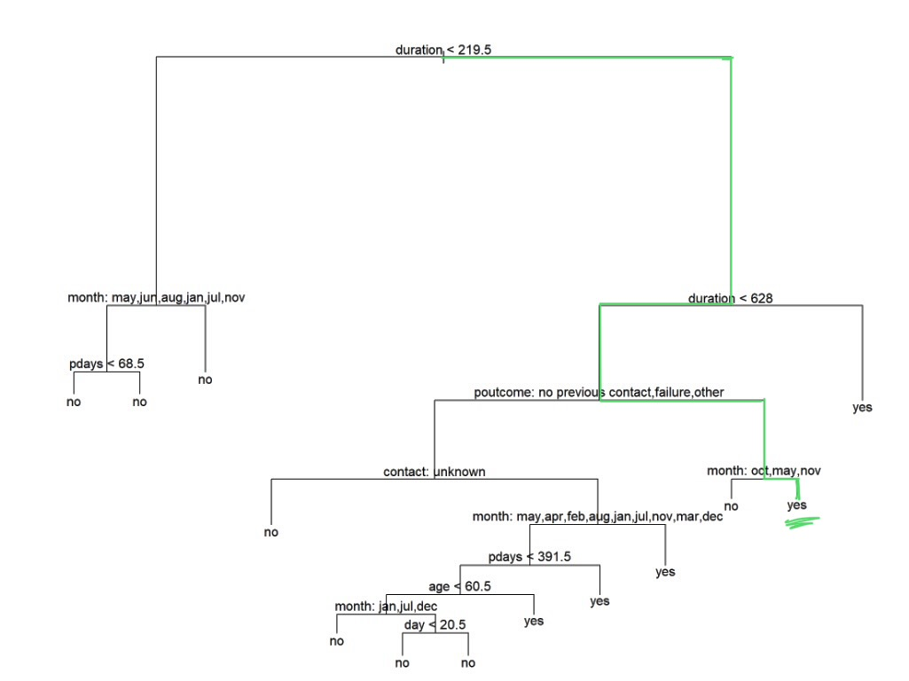
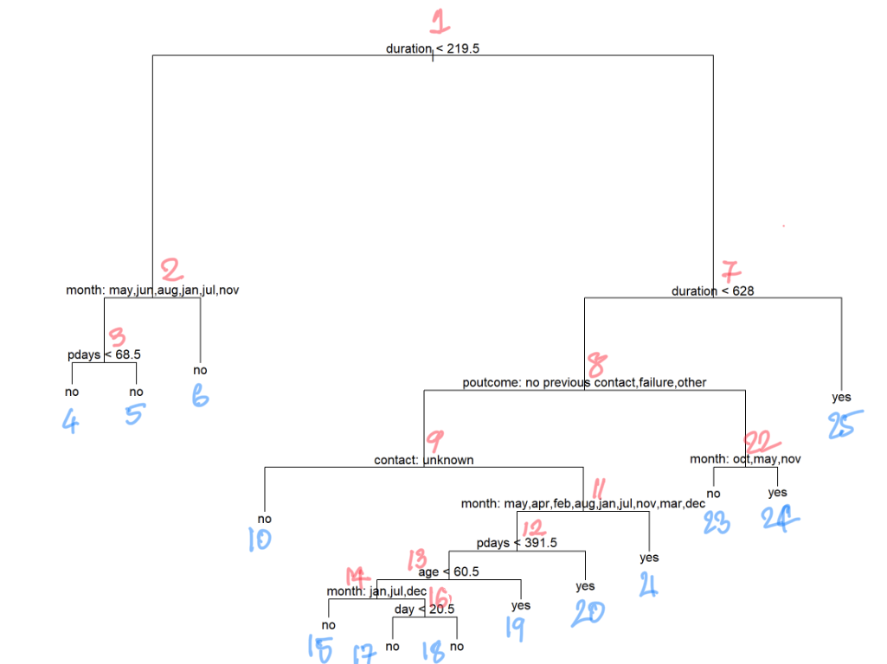
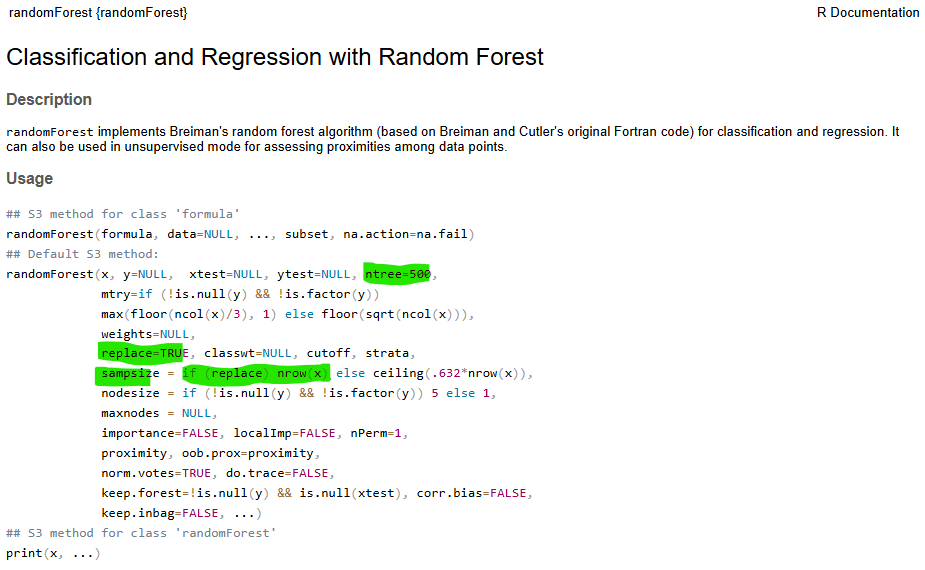

```{r setup, include = FALSE}
knitr::opts_chunk$set(echo = TRUE, eval = TRUE, warning = FALSE, message = FALSE)

library(webexercises)
```

This walk-through is part of the [ECLR](https://datasquad.github.io/ECLR/) page.

## Introduction

Here, we are going to cover decision trees (or "trees") and random forests.

Consider a variable which you wish to predict ($y$, dependent variable) and a whole set of variables ($x$s, explanatory variables) you wish to use in order to predict the value for $y$. If you end up on this page we assume that you are familiar with regression models which basically use a liner relationship to achieve this task.

A tree works by creating splits within the predictor space such that outcome values within each sub-region are progressively more similar. This can create very nonlinear relationships between the $x$ variables and $y$. 

Visually, these splits can be represented in a tree‑like structure: each split creates a new branch, and the final branches—where no further splitting is useful—are called leaves. As you will see below you will have to imagine wonky and asymmetric trees. The leaves will bear a value that is:

-   the **most common** outcome in that branch (for a categorical or binary outcomes - often then called a **classification tree**), or
-   the **average** outcome in that branch (for continuous outcomes, **regression tree**)

Predictions for new observations are made on the basis of this tree. 

A single tree tends to overfit the data it's fed, resulting in incorrect predictions when tested on new data. This is a very common issue for any nonlinear models (e.g. neural networks) and when you use these methods you need to be aware of this and guard against this effect. Bagging and random forests are methods to deal with this particular problem. They will be discussed towards the end of this walkthrough. 

Note: For this walkthrough, we are assuming that you are already familiar with cross-validation - a technique commonly used to choose model hyperparameters. A cross-validation walkthrough is available in ECLR on this [link](https://datasquad.github.io/ECLR/R_CrossValidation/R_CrossValidation.html).

## The Problem and the Data

We will look at an application to Bank Telemarketing Data (available [here](https://archive.ics.uci.edu/dataset/222/bank+marketing)), which is a popular dataset for testing ML algorithms. Download the file on that website. In the downloaded zip folder go to the bank folder and download 'bank.csv'. There you will also find 'bank-names.txt' which is the data documentation with additional information on the data and the variables.

It's a real-world data set of a phone-based marketing campaign by a Portuguese banking institution. The aim of the campaign was to get clients to subscribe to a term deposit. 

The data set contains four Comma Separated Values files (".csv"). We named it 'banks.csv', which has 10% of the observations in the original data and fewer input variables. Using this smaller file makes it easier to run machine‑learning methods that require more computing power. We recommend that you engage with this walkthrough using the reduced dataset in 'banks.csv'. The full dataset is also available from the downloaded zip file.

Look at the data documentation to answer the following question.

::: {.callout-note}
### Exercise

Which of the following statements is **not** correct?

```{r, echo = FALSE}
opts_p <- c(
   "The reduced dataset contains a randomly selected sample of 10% of the original dataset.",
   answer = "All (potential) customers in the dataset were only contacted once",
   "None of the variables has missing values.",
   "The balance variable is expressed in euros.",
   "When the variable 'marital' indicates divorced it could also mean that the contact was widowed.",
   "The data come from May 2008 to November 2010."
)
```

`r longmcq(opts_p)`
:::

## Setup and Data Upload

Let's load some necessary packages.

```{r, warning= FALSE, message=FALSE}
# for all things data handling
library(tidyverse)                              
# for building trees and random forests
library(tree)                                                      
library(randomForest)                                              
```

Let’s load the bank telemarketing data.

```{r}
bank <- read.table("../data/bank.csv", 
  header = TRUE,
  sep = ";", 
  na.strings = c("", " ")) 

str(bank)
```

`r hide("Adjust file path")`

In the above command the file is loaded from "../data/bank.csv". This means that, from the current working directory we went back up one level ("..") then we went into the folder "/data" and in that folder we had saved "/bank.csv".

It is unlikely that this is your file structure. You set your working directory with `setwd()` and if you saved the data file straight in that folder you merely have to call "bank.csv".

As usual it is super important to know where your files live on your computer.

`r unhide()`

The data consists of 17 variables and 4521 observations. The outcome of interest is the one simply called `y`. `y = no` indicates the client did not subscribe to the term deposit, `y = no` indicates that a client did.

The variable descriptions are available from the data [documentation](https://raw.githubusercontent.com/datasquad/ECLR/refs/heads/gh-pages/R_Forests/bank-names.txt). Many variable names are self-explanatory. Here we merely copy some of the definitions:

* `job` : type of job (categorical: "admin.", "unknown", "unemployed", "management", "housemaid", "entrepreneur" ,"student", "blue-collar", "self-employed", "retired", "technician", "services") 
* `education` (categorical: "unknown","secondary","primary","tertiary")
* `balance`: average yearly balance, in euros (numeric) 
* `poutcome`: outcome of the previous marketing campaign (categorical: "unknown", "other", "failure", "success")
* `pdays`, number of days that passed by after the client was last contacted from a previous campaign

Notice, all the factor variables have been loaded as character variables. In order to proceed with the exercise, we will need to convert them to factor variables.

```{r}
# converts characters into factor variables in one go
bank <- bank %>%  mutate(across(where(is.character),as_factor))

# check if characters have been converted into factors
str(bank)                                                             
```

Have a look at summary statistics to understand the data better. 

```{r}
summary(bank[c("age", "job", "marital")])
```
::: {.callout-note}
### Exercise

Calculate the summary statistics for `balance`, `housing` and `loan` and answer the following questions.

The average `balance` is `r fitb(1423, tol = 0.5)`.

The number of individuals with a housing loan is `r fitb(2559)`.

The number of individuals without a personal loan is `r fitb(3830)`.

`r hide("Solution")`

```{r}
summary(bank[c("balance", "housing", "loan")])
```

`r unhide()`
:::

::: {.callout-note}
### Exercise

There are missing values in the data. `r torf(FALSE)` 

`r hide("Explanation")`

If there were any true missing values in the data, their count within each variable would appear at the bottom of the variable's summary statistics. Notice, however, that **unknown** is a commonly occurring value for some of the factor variables. These values were coded as **unknown** rather than **NA**, perhaps because many statistical programming commands would fail if the data contained true missing values.

The data documentation also mentions that there are no missing values.

`r unhide()`
:::

Let's look at the outcome variable more closely. 

```{r}
prop.table(table(bank$y))
```

Only slightly more than a tenth of clients subscribed to term deposits during the telemarketing campaign. Such imbalance is quite common in real-world data. However, this results in machine-learning models becoming very good at predicting the majority class (`y = no`), while struggling to learn patterns related to the minority class (`y = yes`). There are specialised techniques for addressing this issue, but to keep the exercise straightforward, we will not apply them here.


### Handling 'unknown' values

It is worth considering if something can be done about unknown values in the data. If they are left as is, and a tree split is performed along this value, it can decrease interpretability of the tree. 

Consider the variable `poutcome` (indicating whether the client had signed up to a previous campaign they were contacted for), which has more than 80% of "unknown". From the data documentation document and the description of `pdays`, `pdays = -1` means the client was not previously contacted. The following check shows that all the unknown cases in `poutcome` were the ones previously not contacted.

```{r}
# tells us the value of poutcome if pdays = -1 
summary(bank$poutcome[bank$pdays == -1])       

# tells us the value of pdays if poutcome = unknown 
summary(bank$pdays[bank$poutcome == "unknown"])
```

Therefore, for the variable `poutcome` the value "unknown" isn't really an unknown value, it just indicates that this variable is not applicable to these clients.

We can replace `poutcome = unknown` with a more representative value. Let's call this new value `No previous contact` and recode the variable.

```{r}
levels(bank$poutcome)[levels(bank$poutcome)=="unknown"] <- "no previous contact"
summary(bank$poutcome)
```

Examine the summary stats of the `education` and `contact` variables. 

```{r}
summary(bank[c("education", "contact")])
```
They also have a considerable share of unknowns. In other datasets you will have significant numbers of missing values. In these cases it is important to carefully think about how to deal with these. Consider the following possible ways to deal with these. 

a. Replace unknowns with the mode of each variable. 
b. Check if the unknowns are correlated with any other client characteristics available in the data 
c. Leave it as it is for now, and come back to it later. 
d. Drop `contact` from the dataset as it has a large share of unknown, and keep `education` as is. 

Let's consider each option, one-by-one. 

a. is simple to execute and may work if unknowns are not correlated with other characteristics. 
b. can provide a more informed manner of going about replacing unknown values,
c. is the simplest to start with. However, if the variables with lots of unknown values are important in prediction, then dealing with it becomes important for interpretability. 
d. may **not** be a good move to start with, in case, the variables are useful in prediction. 

We will for now stick with c.


## Estimating the tree

To fit a tree to the data and evaluate it for its accuracy in prediction, we place the observations randomly into training and test sets. The training set will be used to fit a classification tree that models `y`. All other variables will be provided as inputs (or features or explanatory variables).

```{r}
# initialises the random sampling 
set.seed(6)                                                            
train_id <- sample(1:nrow(bank),round(nrow(bank)/2,0))                        
train_data <- bank[train_id, ]
test_data <- bank[-train_id, ]
```

::: {.callout-note}
### Exercise

In the above code you will find the line `set.seed(6)`. What role does it play and why is it important?

```{r, echo = FALSE}
opts_p <- c(
   "The line is not important and the following code will run even without it.",
   "The line is important as it ensures that all outputs are rounded to 6 decimal places.",
   answer = "The code would run even without the line, but the line ensures that results remain the same in repeated code runs.",
   "Including this line ensures that Meta plants 6 oak tree seedlings."
)
```

`r longmcq(opts_p)`

`r hide("Explanation")`
Perhaps you already realised that the `sample` function randomly samples row numbers, on this occasion sampling `r round(nrow(bank)/2,0)` numbers from 1 to `r nrow(bank)`.

You may also know that computers do not use real random numbers. Setting the random seed ensures that you do draw the same random numbers which means that when you run the code repeadedly you always get the same "random" selection and subsequent results remain unchanged.

In case that was not obvious to you, which is totally understandable, you could ask the question to your favourite LLM, like ChatGPT or Copilot. Copy the code snippet ans ask something like "I am using some R code to estimate a regression tree. Here are some lines of code to prepare the data. What role does set.seed(6) play?"

LLM are usually very good in explaining code.

`r unhide()`


When `sample()` draws random row numbers it could happen that the same row is selected more than once. `r torf(FALSE)`

`r hide("Hint")`

Go to the Console in RStudio and type `?sample` to call up the help information for the `sample` function.   

`r hide("Explanation")`
The key question here is whether `sample` draws random numbers with or without replacement. I.e. if row 57 was drawn once, could it be that it is drawn again. 
The help function starts with 

`sample(x, size, replace = FALSE, prob = NULL)`

which indicates that the default for the `replace` option in that function is `FALSE` meaning that it would not replace, i.e. row 57 could not be drawn twice. And that is exactly as we want it to be as we want to split the sample.

`r unhide()`

`r unhide()`

:::

Now we can estimate (`fit`) the tree using the training data (`train_data`).

```{r}
# fits a tree to the training data
tree.bank <- tree(y ~ ., train_data)                                        
```

A plot of the fitted tree produces the following:

```{r fig.height=10, fig.width=12}
plot(tree.bank)                                                   
text(tree.bank, pretty = 0) 
```

We can see which variables have been split and at what value.The splits are *internal nodes*, which can result in a branch or leaf. *Each internal node is labelled based on the condition governing the left-hand of the split.* For e.g. at the top-most split, the left-hand branch contains all the observations where `duration < 219.5` (approx. 3.5  minutes). The right-hand branch contains all the observations where `duration >= 219.5`. The region where the predictor space is not split any further is a leaf or a *terminal node*. The leaf carries the value of the outcome predicted for that region. In a classification problem, each leaf is assigned the majority class within that leaf, here either "yes" or "no" as these are the only two possible outcomes. 


::: {.callout-note}
### Exercise

Test your understanding. If call-`duration` was between 4-10 minutes and `poutcome = success`, what was the most likely outcome if a call was placed in July? 

`r mcq(c(answer = "y = yes","y = no"))`


`r hide("Solution")`

The answer is `y = yes`. 

```{r echo=FALSE, fig.align = "center"}

```

`r unhide()`

:::


Some of the splits yield branches having the same predicted outcome. For example, the first two terminal nodes from the left of the plot (internal node of `pdays < 68.5`) have the same classification of `no`. Why does the tree algorithm perform the split in that case? The algorithm may still perform the split to increase *node purity* i.e. the share of observations belonging to a single class in the branch/leaf increases.

You may wonder why the algorithm did not consider producing more final nodes. The algorithm stops producing more nodes when either the nodes become too small or if the improvement of the data fit becomes too small. These stopping criteria are controlled by the options in the `tree.control` function. The `mincut` (default setting = 5) and `minsize` (=10) options control the minimum node size and `mindev` (=0.01) the required improvement.


The `summary ()` function will give some useful tree statistics.

```{r}
summary(tree.bank) 
```

Only 7 of the 16 available predictors are used in tree construction. The size of the tree, which is a measure of tree complexity is 13 (number of terminal nodes). The residual mean deviance measures how well the tree fits the data. It is the deviance divided by the degrees of freedom i.e. number of observations minus the tree-size. Misclassification error is similar to deviance, measuring the proportion of observations that are incorrectly classified—i.e., those whose actual outcome differs from the majority class of the leaf they belong to. In this case, it’s 9.69 percent. 

It can be instructive to see the subscription probabilities for the branches/leaves. These are saved in `tree.bank$frame`.

```{r}
tree.bank$frame$yprob
```

The random forest algorithm aims to maximise node purity, and so the the classification probabilities will tend towards 0 or 1. Note, there are 13 terminal nodes and 12 internal nodes giving rise to 25 outcome probabilities.

There are other pieces of information about the estimated tree you can get from the frame object in your estimated tree. For instance `n` gives the number of observations at each node. 

```{r}
tree.bank$frame$n 
```

To understand which nodes these are referring too, see how they are numbered. 

```{r echo=FALSE, fig.align = "center"}

```

For instance, node 1 represents the entire predictor space before the first split occurs, therefore it contains 2260 observations. The numbering can be verified by typing `tree.bank$frame`. 


`r hide("How did the tree function decide to split?")`

This is not the place where we will spend time on explaining the details of the algorithm that is implemented. You can refer to James et al. (2021, Chapter 8) for a detailed explanation. 

But it is instructive to look at the above probabilities. The function basically attempts to find a bunch of terminal branches in which the probabilities are as extreme as possible. For instance, take the intermediate branch 22 (which contains 33 observation) in which there was a probability of `y=yes` of 82% and `y=no` of 18%. This was split into the terminal leafs 23 and 24 with 10 and 23 observations respectively. Associated to these were probabilities of `y=yes` of 100% and 40%. Clearly this split created a terminal leaf 24 which very strongly predicts `y=yes`.

The measure used to evaluate how separated the probabilities are is the Gini Index. The formula for the Gini Index is -

$$ 
G = \sum_{k=1}^K \hat{p}_{mk}(1 - \hat{p}_{mk})
$$

Here, $\hat{p}_{mk}$ is the proportion of training observations in leaf (or region) $m$ that belong to class $k$. A *class* is just a category of the response variable - for example, in our case the classes are 'yes' or "1" and 'no' or "0". Notice that $G$ becomes smaller when the values of $\hat{p}_{mk}$ in a leaf are close to zero or one. Because of this property, the Gini Index is also seen as a measure of *node purity*. In a regression problem, node impurity is measured by the Mean Squared Error (MSE) formula, which you have seen in OLS type problems. 

`r unhide()`


## Evaluation

We evaluate the performance of the fitted tree on the test data (`test_data`) using the `predict()` function. To ensure that the predictions are in terms of classes, we need to provide `type = “class”` as an argument.

```{r}
# predicting outcomes in test data set
b.tree.pred <- predict(tree.bank, test_data, type = "class")         

# list with actual outcomes in test data
test_data.y <- test_data$y  

# Confusion matrix
table(b.tree.pred , test_data.y)                                       
```

The table displays how accurately the tree predicted the values of subscription for the test set observations. Model **accuracy** is (1860+140)/2261 = 0.8846 i.e. the share of observations that are predicted correctly. The **sensitivity** of the model, given by the share of positive outcomes that are correctly predicted: 140/257 = 0.54. This is an improvement on the unconditional probability of subscribing (11.68%).


## Tree Pruning

So far there was no penalty for tree complexity. This step should be considered as the tree algorithm will likely overfit the data, which can lead to poor performance on the test set. We set a penalty $\alpha > 0$ for tree size. For any $\alpha$, the goal is to find the optimal subtree (from the original large tree) that minimizes the combined measure:

$$ 
\text{Total error of the Subtree} + \alpha (\text{Size of the Subtree})
$$ 

The larger the $\alpha$ the simpler the tree.

To find the appropriate $\alpha$, we use cross-validation. The `cv.tree()` function progressively increases $\alpha$ value and obtains trees of different sizes from the original tree. These subtrees are then validated in the hold-out fold of the data. The error of the subtrees are averaged across all the folds and stored by the algorithm.

```{r}
set.seed(17)                                                       
cv.bank <- cv.tree(tree.bank, FUN = prune.misclass)                                      
cv.bank                                                 
```

The summary output shows the size of each subtree drawn from `tree.bank` for a given `k` (the penalty that we denoted by $\alpha$). `dev` is the number of cross-validation errors, associated with that subtree.

We plot the error rate as a function of the penalty and tree size.

```{r}
# Plotting the error rate as a function of size and k
par(mfrow = c(1,2))
plot(cv.bank$size, cv.bank$dev, type = "b") 
plot(cv.bank$k, cv.bank$dev, type = "b")
```

The tree size giving the lowest error is one with 4 or 7 nodes. The corresponding penalties are 5 and 2, respectively.

Let's visualise the pruned tree. We first prune the large tree by providing the optimal tree-size and then ask R to plot it. 

```{r}
tree.b.prune <- prune.tree(tree.bank, best = 4, method = "misclass")  
plot(tree.b.prune)
text(tree.b.prune, pretty = 0)
```

Notice how the branches have fallen off the original tree? And, only `duration` and `poutcome` remain.

Let's check if pruning helps in achieving better prediction accuracy. We use the same steps we used when evaluating the performance of the unpruned tree (`tree.bank`) to find out. Complete the code below by replacing `XXXX` with the correct information. Look at the previous call of `predict()` for guidance.

```{r, eval = FALSE}
# fill in the correct input     
b.tree.prune.pred <- predict(XXXX, XXXX, type = "class")       
table(Predicted = b.tree.prune.pred , Actual = XXXX)                  
```

You got it right if you get the table below.

```{r, echo = FALSE}
b.tree.prune.pred <- predict(tree.b.prune, test_data, type = "class")
table(Predicted = b.tree.prune.pred , Actual = test_data.y)                  
```


`r hide("Hint")`

Usually looking at the help for a particular function (here `?predict`) is a really good way to figure out how to use the function. In the case of `predict` this does not work well as `predict` is a very powerful function which works for very different types (or classes) of estimated models. And for every type it may work slightly differently. This is why the help information is slightly too general.

Which of the following queries to a LLM are likely to yield good and useful information?

1. Query 1
  "How do I use predict?"
2. Query 2
  "I am working in R and am estimating regression trees. Now I want to evaluate this estimated tree on a test dataset. How can I use the `predict` function?"
3. Query 3
  "I am working in R and am estimating regression trees. I have estimated a regression tree called `tree.b.prune` for binary outcomes using a training dataset (`train_data`). Now I want to evaluate this estimated tree on a test dataset (`test_data`). Both datasets have identical variables. The outcome variable is called `y`. How can I use the `predict` function?"

`r mcq(c("Query 1", "Query 2", answer = "Query 3"))`

`r unhide()`

Model accuracy increases by a small fraction (approx. 0.0035), while the sensitivity declines. Ideally, we would want a method that increases both.


`r hide("Does pruning always deliver the same result?")`

As the pruning step makes use of cross validation which randomises data into folds, the results could differ for different random seeds. However, in this application this is unlikely as the best tree is so simple.

`r unhide()`

## Bagging 

Trees suffer from high variance. You would get a different tree with each random subset of the data. You can see this by fitting a tree to the test data:

```{r}
tree.bt.test <- tree(y ~ ., test_data)
summary(tree.bt.test)
```

Compared to `tree.bank`, the tree size is smaller and fewer variables are used in tree construction. This is a symptom of high variance in the model. When  variance of a model is high, predictions based on it will be less accurate. A large enough data set will not get rid of the problem of high variance of a tree. Tree pruning will also not necessarily improve accuracy.

Without further action we should always keep in mind that, had we split the data differently, we should expect a quite different model to be chosen and hence quite different forecasts. That is what we mean by variance.

There are a few easily implemented methods to reduce this variance. The first is called **bagging** and uses the technique of bootstrapping. It takes the data supplied, here `test_data` and creates random versions of the data (by randomly drawing samples of observations). Then we calculate a tree for each of these versions and the prediction is averaged. As we are looking at a classification tree (with two possible outcomes here) the averaged prediction is merely the modal prediction, i.e. the prediction that most often occurs for a particular observation.

The method can be implemented with the `RandomForest()` function (which will be re-used for the next section). We apply the function as follows:

* specify the data (`data = train_data`)
* specify the model (`y ~ .`), here dependent variable is `y` and all other variables in the data set can be used (`~.`)
* set the number of variables to be used as tree splits are considered to be equal to the number of explan variables. The need for this will be obvious when we consider the Random Forest method next.

```{r}
# set p equal to number of explan vars (cols in data -1)
p = dim(test_data)[2]-1

# set seed to ensure re-peated applications give same result
set.seed(131)                                            
bag.bt <- randomForest(y ~ ., data = train_data, mtry = p)              
bag.pred <- predict(bag.bt, test_data, type = "class")         
table(Predicted = bag.pred, Actual = test_data.y)
```

Model accuracy is $(1915+105)/2261 =0.8934$ which is a slight improvement on the accuracy compared to the base tree. The sensitivity $105/257 = 0.4086$ however has dropped significantly from 0.54. Such a result, sensitivty not improving through the averaging applied in the bagging algorithm, is more likely to happen when the outcomes are unbalanced (here only 11% `yes` in the sample).

::: {.callout-caution}
### Details of the algorithm

There are different functions/packages you could use to implement bagging. Here we used `RandomForest` but other packages you could use are the `ipred` and `caret` packages. And implementation details may vary. Some of the standard parameters that you may be interested in are

* how many random samples are created, `nrand`
* are samples drawn with or without replacement, i.e. could the same observation occur more than once in a random sample (yes if `replacement = TRUE`)
* how big are the samples drawn (`sampsize`, relative to the sample size of the data, `n`)

Call the help function `?randomForest` to check what the default parameters for `randomForest()` are as we implement it above for our classification problem.

$nrand =$ `r fitb(500)`

$replacement =$ `r mcq(c(answer = "TRUE","FALSE"))`

$sampsize = $ `r mcq(c("0.5 * n","0.632 * n",answer = "n", "1.314*n"))`

`r hide("Explanation")`

When you call the help function you will get this.

```{r echo=FALSE, fig.align = "center"}

```

The highlilighted sections give the answers to the above questions. You could change these parameters. For instance if you wanted to create fewer random samples you could call `randomForest(y ~ ., data = train_data, mtry = p, ntree = 200)`.

Being able to figure out what choices particular functions make is an important part of being an accomplished empirical economist.

`r unhide()`

:::

## Random Forests

The averaging, as applied in the bagging algorithm, works best in terms of reducing the variance if the individual components we are averaging over are not strongly correlated. In the bagging algorithm we applied the same tree optimisation algorithm to different data samples, but we always used all `p` explanatory variables. As a result it is quite likely that the individual predictions are quite similar as they are likely to be based on the same predictors. The **Random Forest** method applies a simple trick to make this component forecasts less correlated and therefore allow for better variance reduction.

Random forests apply the same basic structure as bagging (i.e. creating multiple data samples and estimating treets for each), but in addition, the splits in trees are carried out only by considering a random subset of predictors at a time instead of always considering all `p` predictors. Typically, the number of predictors considered at any split is the square root of predictors ($\sqrt{p}$). This allows the algorithm to build trees that are different from each other. Weaker predictors are given more of a chance to appear in the splits. This will reduce the correlation between trees and therefore strengthen the variance reduction. 

We will use the `randomForest` package in R to apply random forests to the data. Setting `importance = TRUE` prompts the function to calculate importance measures for each predictor. Note that this call is basically the same as previously for bagging, just that we drop the `mtry = p` option which means that we are now operating with the default value for `mtry` which (according to the help function) is `mtry = sqrt(p)`.

```{r}
set.seed(131)                                            
rf.bt <- randomForest(y ~ ., data = train_data, importance = TRUE)              
print(rf.bt)
```

The summary of the output tells us that the model is trained by creating 500 trees using 4 randomly selected predictors for each split. The Out Of Bag (OOB) error is the average error in prediction of training observations not included in the bootstrapped samples. Averaging the predictions of 500 trees is generally considered adequate for stabilising the OOB error rate.

We cannot create a tree-like plot after applying random forests as the predictions are based on 500 different trees. But we can generate variable importance scores for all of the predictors. The function `varImpPlot()` generate plots where variables are displayed in decreasing order of importance. This provides a clear picture of which variables are useful in classification.


```{r}
varImpPlot(rf.bt)                                         
```

Two kinds of scores are being generated: (i) Mean Decrease in Accuracy i.e. the decrease in OOB accuracy when the variable is excluded, and (ii) Mean Decrease in Gini i.e. the total decrease in Gini Index from splitting on the variable.(Gini Index is explained in the earlier explainer 'How did the tree function decide to split?')

There are slight differences in ranking of variables across the plots, but they are generally in agreement with one another, and with the tree we fit earlier, in that `duration` is the variable of primary importance. 

The actual scores can be obtained by typing the following:

```{r}
# displays variable importance scores
importance(rf.bt)                                          
```

The last two columns are displaying the importance scores with higher numbers meaning that variables are more important. Note, there could be negative scores.

Now we should test how well the model works on test data. The `predict()` function will cycle the new data points through all the 500 trees of the forest and predict the class of the point using a majority vote. 

Complete the following code to display the prediction evaluation.

```{r, eval = FALSE}
# fill the missing inputs  
rf.pred <- predict(XXX, XXXX, type = "class")                   
table(Predicted = ZZZ, Actual = YYY)
```

```{r, echo = FALSE}
rf.pred <- predict(rf.bt, test_data, type = "class")                   
table(Predicted = rf.pred, Actual = test_data.y)
```

The test accuracy increases more significantly this time (approx. 1%), however sensitivity decreases even further. This can happen while applying random forests if the outcome is very imbalanced and the model depends on only a few of the predictors.

## Further extensions

To further improve the effectiveness of the random forests method we can consider dropping less important predictors.

Using the variable importance plots above we can identify the least important variables. Here, the four least important variables - education, campaign, loan and default are dropped as an example. This way more relevant variables are being used in the random tree construction.

```{r}
set.seed(131)                                            
rf.bt2 <- randomForest(y ~ . - loan - default - campaign - education, data = train_data, importance = TRUE)  
rf.pred2 <- predict(rf.bt2, test_data, type = "class")                   
table(Predicted = rf.pred2, Actual = test_data.y)  
```

Based on the confusion matrix, we get only a slight improvement in accuracy and sensitivity, compared to `rf.pred`. But importantly note that, while the model predicts 96.5% of all "no"s correctly ($=1933/(1993+71)$) it only predicts 36.6% of all "yes"s correctly ($94/(163+94)$). However, 36.6% is still a substantial improvement from an unconditional prediction of 11%.

## Final thoughts

In this example the dependent variable (the variable we wanted to forecast) is a binary variable. We therefore applied classification trees. We therefore had to use the ` type = "class"` option when we used the `predict()` function. Some of the details, but not the basic ideas, change when the variable to forecast is continuous. Instead of classification trees we then talk of regression trees.

When being concerned about forecasting you carefully have to think about which explanatory variables should really be used. One of the important variables here was `duration` which is defined as "last contact duration, in seconds (numeric)". Typically this last contact could be a sales call to encourage the client to purchase the term product under consideration. 

This then means that the model estimated here would be useful to predict the purchase probability **after** such a sales call. If, however, you want to build a model that helps your sales force pick high probability clients for their sales calls then the model above would not be useful. A model that does not include values representing the actual sales activity would be needed.

The example we dealt with here had very unbalanced outcomes, as only about 11% of the observations were a "yes". This can cause problems as all the above methods reward trees that get predicting the majority class right, but that may not be the most interesting class.

::: {.callout-tip}
### How do deal with unbalanced classes?

There are a number of ways to deal with this issue. This walkthrough cannot address these. A good starting point may be that you enlist the help of your friendly LLM (e.g. ChatGPT or Copilot) for advice. A useful query may be:

"I am estimating classification trees for a binary variable (with yes/no) as outcomes. Only about 10% of my outcomes are yes. What implications does this have for the classification tree analysis? Are there techniques that can deal with this? Can you also provide me with some references on this issue, in particular referring to the practical guidance."

As always it is important to ask for the original source material such that you can ensure, by referring to the original material, that the remedies indeed address your problem.

:::

## Reading

* A general overview of these techniques is available from Hattie et al (2003), Introduction to Statistical earning, with Applications in R, Section 8, available from [the book's website](https://www.statlearning.com/).
* The paper that used this dataset originally: S. Moro, R. Laureano and P. Cortez (2011) Using Data Mining for Bank Direct Marketing: An Application of the CRISP-DM Methodology. In P. Novais et al. (Eds.), Proceedings of the European Simulation and Modelling Conference - ESM'2011, pp. 117-121, Guimarães, Portugal, October, 2011. EUROSIS.
* A textbook that focuses on predictive modelling is Kuhn, M. and Johnson, K. (2013). Applied Predictive Modeling. Springer. Chapter 16 is dedicated to the issue of class imbalance.


This walk-through is part of the [ECLR](https://datasquad.github.io/ECLR/) page.

