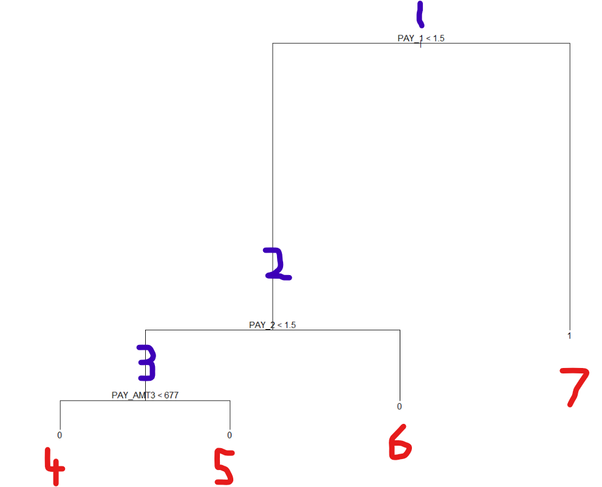

```{r setup, include = FALSE}
knitr::opts_chunk$set(echo = TRUE, eval = TRUE, warning = FALSE, message = FALSE)

library(webexercises)
```

This walk-through is part of the [ECLR](https://datasquad.github.io/ECLR/) page.

## Introduction

Here, we are going to cover decision trees (or "trees") and random forests. 

A tree works by creating splits within the predictor space such that outcome values within each sub-region are progressively more similar. Visually, these splits form a tree‑like structure: each split creates a new branch, and the final branches—where no further splitting is useful—are called leaves. The leaves will bear a value that is:

-   the **most common** outcome in that branch (for a categorical or binary outcomes), or
-   the **average** outcome in that branch (for continuous outcomes)

Predictions for new observations are made on the basis of this tree. 

A single tree tends to overfit the data it's fed, resulting in incorrect predictions when tested on new data. In random forests, many trees are created from the same data and the average of their predictions is assigned to a new observation. This can be a powerful way to increase prediction accuracy. 

Note: For this walkthrough, we are assuming that you are already familiar with cross-validation - a technique commonly used to choose model hyperparameters. A cross-validation walkthrough is available in ECLR on this [link](https://datasquad.github.io/ECLR/R_CrossValidation/R_CrossValidation.html).

## The Data

We will look at an application to Bank Telemarketing Data (available [here](https://archive.ics.uci.edu/dataset/222/bank+marketing)), which is a popular dataset for testing ML algorithms. Download the file on that website. In the downloaded zip folder go to the bank folder and download 'bank.csv'. There you will also find 'bank-names.txt' which is the data documentation with additional information on the data and the variables.

It's a real-world data set of a phone-based marketing campaign by a Portuguese banking institution. The aim of the campaign was to get clients to subscribe to a term deposit. 

The data set contains four Comma Separated Values files (".csv"). We named it 'banks.csv', which has 10% of the observations in the original data and fewer input variables. Using this smaller file makes it easier to run machine‑learning methods that require more computing power. We recommend that you engage with this walkthrough using the reduced dataset in 'banks.csv'. The full dataset is also available from the downloaded zip file.

Look at the data documentation to answer the following question.

Which of the following statements is **not** correct?

```{r, echo = FALSE}
opts_p <- c(
   "The reduced dataset contains a randomly selected sample of 10% of the original dataset.",
   answer = "All (potential) customers in the dataset were only contacted once",
   "None of the variables has missing values.",
   "The balance variable is expressed in euros.",
   "When the variable 'marital' indicates divorced it could also mean that the contact was widowed."
)
```

`r longmcq(opts_p)`


## Setup and Data Upload

Let's load some necessary packages.

```{r cars, warning= FALSE, message=FALSE}
library(readxl)                                                     # to read the data
library(tidyverse)                                                    
library(dplyr)
library(magrittr)                                                   # the last three packages help with data transformation
library(tree)                                                       # for building trees
library(randomForest)                                               # for random forests
```

Let’s load the bank telemarketing data.

```{r}
bank <- read.table("../data/bank.csv", 
  header = TRUE,
  sep = ";", 
  na.strings = c("", " ")) 

str(bank)
```

The data consists of 17 variables and 4521 observations. The outcome of interest is the one simply called 'y'. 'y = no' indicates the client did not subscribe to the term deposit.

The variable descriptions are pasted from bank-names.txt, which is provided along with the data:

   1) age (numeric)
   2) job : type of job (categorical: "admin.","unknown","unemployed","management","housemaid","entrepreneur","student",
                                       "blue-collar","self-employed","retired","technician","services") 
   3) marital : marital status (categorical: "married","divorced","single"; note: "divorced" means divorced or widowed)
   4) education (categorical: "unknown","secondary","primary","tertiary")
   5) default: has credit in default? (binary: "yes","no")
   6) balance: average yearly balance, in euros (numeric) 
   7) housing: has housing loan? (binary: "yes","no")
   8) loan: has personal loan? (binary: "yes","no")
   # related with the last contact of the current campaign:
   9) contact: contact communication type (categorical: "unknown","telephone","cellular") 
  10) day: last contact day of the month (numeric)
  11) month: last contact month of year (categorical: "jan", "feb", "mar", ..., "nov", "dec")
  12) duration: last contact duration, in seconds (numeric)
   # other attributes:
  13) campaign: number of contacts performed during this campaign and for this client (numeric, includes last contact)
  14) pdays: number of days that passed by after the client was last contacted from a previous campaign (numeric, -1 means client was not previously contacted)
  15) previous: number of contacts performed before this campaign and for this client (numeric)
  16) poutcome: outcome of the previous marketing campaign (categorical: "unknown","other","failure","success")
  17) y: has the client subscribed a term deposit? (binary: "yes","no")

Notice, all the factor variables have been loaded as character variables. In order to proceed with the exercise, we will need to convert them to factor variables.

```{r}
bank %<>% mutate(across(where(is.character),as_factor))               # converts characters into factor variables in one go
str(bank)                                                             # check if characters have been converted into factors
```

Have a look at summary statistics to understand the data better. 

```{r}
summary(bank)
```


## Reading

A general overview of these techniques is available from Hattie et al (2003), Introduction to Statistical earning, with Applications in R, Section 8, available from [the book's website](https://www.statlearning.com/).


# OLD

Suppose you need to eat out tonight. How do you decide where to go? If distance is your top priority, you first rule out all restaurants beyond a certain range. Next, you might consider budget, narrowing the list further to only the restaurants where you can have a mean for less than £20. Then, you continue filtering out by the next most important factor until you are left with a single choice. This is essentially how statistical decision trees work.

> RB: I see what you have in mind here, I am having trouble with the "reducing to one restaurant" part. As trees are for predicting I think it would be useful to use prediction in the Analogy.
Say, " Let's imagine you are waking up and are attempting to predict the amount of traffic and therefore how long itr will take you to drive your car from your home to work. You have many years of experience of making this trip, and being a nerdy accountant recorded all your trip times along with the date, the day of the week and the weather. First you consider the day of the week. You know that traffic on weekdays is much worse than on weekends. As it is a weekday the only consider past weekdays to be informative. You also note that it is July and noticed that traffic during the summer months is different to that during other months, so you only consider days that were in July, August and September and lastly you note that it  is raining. You therefore filter your spreadsheet to only give you past travel times for rainy weekdays during the summer holidays. You calculate the average travel time on these days to be 34 minutes. You predict that it will take you 34 minutes to get to work.  

Given a data set with predictors and outcomes, a tree is constructed by sequentially splitting the predictor space into smaller regions with the goal of minimizing the variation in the outcomes within each region. To make a prediction for a new observation, the method checks which region it falls into, and then predicts a value that is:

* the **average** outcome in that region (for continuous outcomes), or
* the **most common** outcome in that region (for a categorical or binary outcomes).  

Trees are popular because they are easy to interpret and visualize which can help to communicate the value of such a model. However, on their own, trees often can suffer from over-fitting and hence can have a lower prediction accuracy than other, simpler modelling techniques. As a result, solutions like *random forests* have arisen, where many trees are created and their predictions combined for better accuracy. 
In this walkthrough, you will:

* fit a single tree to a data set and test its predictive performance 
* fit multiple trees using randomly selected predictors (random forests) and compare their performance to a single tree

While the main exercises focus on classification problems (categorical or binary outcomes), we will also look briefly at how trees handle regression problems (continuous outcomes).

The example we use here is an application to a dataset which is commonly used in Machine Learning training. The dataset provides information on people who have a credit card. We do have some demographic information, but also the spending, the balance and the repayments for the credit card in the previous 6 months (April to September 2005). The outcome variable we wish to predict is whether a customer will default on their credit card payments in October 2005. 

The dataset is available from [UC Irvine Machine Learning repository](https://archive.ics.uci.edu/dataset/350/default+of+credit+card+clients) from where you can download a "xls" file called "default of credit card clients.xls" which you should download into your folder so that you can load it.

We will also assume that you are already familiar with cross-validation - a technique commonly used to choose model hyperparameters. A cross-validation walkthrough is available in ECLR on this [link](https://datasquad.github.io/ECLR/R_CrossValidation/R_CrossValidation.html).   


# Setup and Data Upload

Let's load some necessary packages.

```{r}
library(ISLR2)  # contains the data sets in ISLR, 2nd Ed.
library(tree)   # for building trees
library(randomForest) # for random forests
library(readxl)
library(tidyverse)
```

Let's load the dataset with information on 30,000 customers.

```{r}
data.cc <- read_excel("../data/default of credit card clients.xls", skip = 1)
names(data.cc) <- make.names(names(data.cc)) # removes spaces from names
head(data.cc)
```

Each row in the data represents information on one customer. To obtain details on the variables you should read the information provided on [the dataset's download page](https://archive.ics.uci.edu/dataset/350/default+of+credit+card+clients). 

```{r}
str(data.cc)
```

For simplicity we shall change the name of the outcome variable from `default.payment.next.month` to `default`. We also rename `PAY_0` to `PAY_1` (explanation below) and delete the `ID` variable.

```{r}
data.cc <- data.cc %>% rename(default = default.payment.next.month,
                              PAY_1 = PAY_0) %>% 
                      select(-ID)
```

How many variables does the data set contain?  `r fitb(25)`

Look at some summary statistics, especially for the `AGE` variable.

`r hide("I need a hint")`

You could for instance use the `summary` function, e.g. `summary(data.cc)` for all variables or `summary(data.cc$AGE)` for only the `Sales` variable.

`r unhide()`

What is the median value for Age?  `r fitb(34)`

# Descriptive Analysis

Before thinking about predicting the `default` variable it is important to understand the data.

Let us look at a particular observation.

```{r}
data.cc[34,]
```

To understand the data it is good to understand what the numerical values for the demographic variables stand for.

|variable | values|
|:------|------:|
|SEX | 1 = male; 2 = female|
|EDUCATION | 1 = graduate school; 2 = university; 3 = high school; 4 = others|
|MARRIAGE | 1 = married; 2 = single; 3 = others|

The other variables that are being used are

|variable | values|
|:------|------:|
|LIMIT_BAL | Amount of the given credit (New Taiwan dollar)|
|PAY_1 to _6 | repayment status from Sept 2005 back to April 2006. -2: No consumption that month, -1: Paid in full and on time, 0: made minimum payment, 1–9: Number of months payment delayed|
|BILL_AMT1 to _AMT6 | Amount of bill statement (NT dollar) from Sept to April|
|PAY_AMT1 to _AMT6 | Amount of payment (NT dollar) from Sept to April|

Let's look at the distribution of outcomes for `PAY_1`.

```{r}
table(data.cc$PAY_1)
```

You can see that the majority of customers (in Sept 2005) either had nothing to pay or did deliver at least the minimum repayments. 

Next we shall see whether this distribution is very different for the different genders.

```{r, echo = FALSE}
table(data.cc$SEX, data.cc$PAY_1)
```

How many women did not spend anything on their credit card in Sept 2005 (`PAY_1 == -2`)?  `r fitb(1888)`

`r hide("How can I figure this out?")`

You want a bivariate version of the above (`table(data.cc$PAY_1)`). Thr what happens if you use `table(variable1, variable2)`. You could also filter data to only keep observations for women (`SEX == 2`) and `PAY_1 == -2` and then see how many you are left with. But the first is better.

`r unhide()`

Which of the following statements is correct?

```{r, echo = FALSE}
opts_p <- c(
   "There seem to be no obvious differences in spending and repayment patterns between men and women",
   answer = "Women in the sample, more often than men, either spend nothing on the credit card or pay everything back immediately.",
   "Men in the sample, more often than men, either spend nothing on the credit card or pay everything back immediately."
)
```

`r longmcq(opts_p)`

Before we embark on the modelling exercise it is important to understand the properties of the outcome variable. We know that it is a binary variable (`default == 1`) is equivalent to default and 0 to no default.

```{r}
prop.table(table(data.cc$default))
```

This means that more than a 5th of all customers default in October 2005.

Before proceeding to built a regression tree we need to convert the numerical variable `default` into a factor variable. 

`r hide("Why is that needed?")`

Before using a new function like the `tree` function below. YOu should have a look at the functions help function (`?tree`). When you do that here you will be able to read under the "FORMULA" entry that "The left-hand-side (response) should be either a numerical vector when a regression tree will be fitted or a factor, when a classification tree is produced. " 

Here we wish to estimate a classification tree as our outcome variable is discrete and therefore the outcome variable needs to be of factor type.

`r unhide()`

```{r}
data.cc$default <- as.factor(data.cc$default)
```

# Estimating the Tree

Now we can start the estimation process.

## Splitting into training/estimation and testing set

We place the observations randomly into training and test sets. The training data set will be used to fit a classification tree that models `default`. All variables except sales will be provided as inputs. 

```{r}
set.seed(6)                                                            # initialises the random sampling, split 50-50
train <- sample(1:nrow(data.cc), nrow(data.cc)/2)                 
cc.train <- data.cc[train, ]
cc.test <- data.cc[-train, ]

```

## Estimation

```{r}
tree.cc.data <- tree(default ~ ., cc.train) 
```

A plot of the fitted tree produces the following:

```{r fig.height=10, fig.width=12}
plot(tree.cc.data)                                                   # builds the tree plot
text(tree.cc.data, pretty = 0)                                       # adds labels to the plot 
```

In the plot, we are seeing three splits from which four branches emerge. *Each split is labelled based on the condition governing the left-hand branch of that split.*

At the end of the branch you can see the outcome category predicted. Here only the right most branch predicts a default (when `PAY_1>1.5` i.e. in Sept 2005 the customer had at least a 2 month payment delay). The three variables which are used in the splits are `PAY_1`, `PAY_2`, i.e. the qualitative measure of payment history, and `PAY_AMT3`, the amount repaid in July 2005. If a customer had a payment delay in September of more than 1 month they would be classified in the right hand side branch.

It can be instructive to see the default probabilities for the branches. These are saved in `tree.cc.data$frame$yprob`

```{r}
tree.cc.data$frame$yprob
```

There are other pieces of information about the estimated tree you can get from the `frame` object in your estimated tree. For instance `n` will give you the number of observations

```{r}
tree.cc.data$frame$n
```

As you can see there are 7 rows of outcome probabilities and 7 observation numbers, but there are only 4 terminal nodes. It is important to understand how these are numbered.

{#fig-LABEL fig-alt="ALT"}

The nodes or leafs labeled in red (with their corresponding row numbers) are the final nodes, the nodes labeled in blue are "intermediate" nodes or branches that subsequently have been split.

For instance node 1 represents the entire dataspace before the first split happens. This is applied to all observations in the training set (15,000) and you can see that the default probability here (22%) is basically the same as the default probability we saw in the entire dataset.

Final Leaf 7 applies to 1,539 customers and amongst these the probability of default is almost 71% (and therefore, as that is > 50% default is predicted). Leaf 4 applies to 3,376 customers in the training set and here the default probability is 21%. The branch with the lowest default probability is Leaf 5 where customers repaid more than 677 NT$ in July.

Look at the fifth customer in `data.cc`, which of the final/terminal four branches does that customer belong to?

"The customer belongs to `r mcq(c("Branch 4", answer =  "Branch 5", "Branch 6", "Branch 7"))` 


`r hide("How can I get this result?")`

You need to find the observations for the relevant variables ("PAY_1", "PAY_2", "PAY_AMT3") for the 5th customer.

`r unhide()`


`r hide("How did the tree function decide to split?")`

This is not the place where we will spend time on explaining the details of the algorithm that is implemented. You can refer to James et al. (2021, Chapter 8) for a detailed explanation. 

But it is instructive to look at the above probabilities. The function basically attempts to find a bunch of terminal branches in which the probabilities are as extreme as possible. For instance, take the intermediate branch 3 in which there was a probability of default of 14%. This was split into the terminal leaf 4 and 5, as these offered quite different default probabilities, 21% and 11% respectively. The split at `PAY_ATM3 < 677` was the split that delivered the clearest division.

The measure used to evaluate how separated the probabilities are is the Gini Index. The formula for the Gini Index is -

$$ 
G = \sum_{k=1}^K \hat{p}_{mk}(1 - \hat{p}_{mk})
$$

Here, $\hat{p}_{mk}$ is the proportion of training observations in leaf (or region) $m$ that belong to class $k$. A *class* is just a category of the response variable - for example, in our case the classes are 'default' or "1" and 'No default' or "0". Notice that $G$ becomes smaller when the values of $\hat{p}_{mk}$ in a leaf are close to zero or one. Because of this property, the Gini Index is also seen as a measure of *node purity*. In a regression problem, node impurity is measured by the Mean Squared Error (MSE) formula, which you have seen in OLS type problems. 

`r unhide()`

A summary off the estimated tree can be seen from the `summary` function.

```{r}
summary(tree.cc.data)
```

The number of terminal nodes tells us the tree's size. The larger it is, the more complex the tree. The residual mean deviance is a measure of how well the tree fits the training data. The lower the value of the deviance, the better the model fits the training data. The misclassification rate is giving us the training error rate - the proportion of training observations in a leaf that are incorrectly predicted by the leaf's majority class. In this case, it's 17.8 percent. 

You may wonder why the algorithm did not consider producing more final nodes. The algorithm stops producing more nodes when either the nodes become too small or if the improvement of the data fit becomes too small. These stopping criteria are controlled by the options in the `tree.control` function. The `mincut` (default setting = 5) and `minsize` (=10) options control the minimum node size and `mindev`(=0.01) the required improvement. Below we will reduce the required improvement in fit by reducing `mindev` to 0.002.

```{r}
ctrl <- tree.control(nobs = nrow(cc.train), 
                     mindev = 0.002,  # minimum deviance reduction
                     mincut = 5,      # min obs in each child
                     minsize = 10)    # min obs in a node to be split

```

Then, when you estimate the tree, feed `ctrl` into the `tree` procedure.

```{r fig.height=10, fig.width=12}
tree.cc.data.v2 <- tree(default ~ ., cc.train, control = ctrl) 
plot(tree.cc.data.v2) 
text(tree.cc.data.v2, pretty = 0)                                      
```

## Evaluation

We should now evaluate the performance of the fitted tree on the test data. The predict() function allows us to do that. To ensure that the predictions are in terms of classes, we need to provide type = "class" as an argument.

```{r}
cc.tree.pred <- predict(tree.cc.data, cc.test, 
                     type = "class")      # predicting outcomes in test data set
cc.test.default <- cc.test$default        # list with actual outcomes in test data
table(cc.tree.pred , cc.test.default)     # Confusion matrix
```

The table displays how accurately the tree predicted the values of `default` for the test set observations. Altogether ((11169+1091)/15000 = 82%) of observations are predicted correctly. However, only about a third of defaults (33%) are correctly predicted. This is an improvement on the unconditional probability of default of 22%.

When producing the same confusion matrix with `tree.cc.data.v2` how does the predictive performance change?

```{r, echo = FALSE}
# use sample() to randomise the order
opts_ci <- sample(c(
  answer = "it does not change at all, v2 was no improvement on the original tree",
  "v2 predicts better overall, but mainly because it improves predicting non-defaults",
  "v2 predicts better overall, but mainly because it improves predicting defaults",
  "the original predicts better overall, but mainly because it improves predicting non-defaults",
  "the original predicts better overall, but mainly because it improves predicting defaults"
))
```

`r longmcq(opts_ci)`

## Pruning


## Tree pruning

So far, we have not included a penalty for tree complexity. This step should be considered as the algorithm will likely overfit the data, which can lead to poor performance on the test set. Let's set a penalty $\alpha > 0$ for tree size since we know this is a measure of tree complexity. For any $\alpha$, the goal is to find the optimal subtree (from the original large tree) that minimizes the combined measure:

$$ 
\text{Total error of the Subtree} + \alpha (\text{Size of the Subtree})
$$

The larger the $\alpha$ the simpler the tree. 

We will perform cross-validation to find a tree of the appropriate size. The cv.tree() function progressively increases $\alpha$ value and obtains trees of different sizes from the original tree. These subtrees are then validated in the hold-out fold of the data. The error of the sub-trees are averaged and presented in the output summary.  

```{r}
set.seed(5)                                                       
cv.cc <- cv.tree(tree.cc.data.v2,                             # cross-validates subsets of the tree 
     FUN = prune.misclass)                                        
cv.cc                                                       # view output
```

The final output shows the size of each subtree selected from `tree.cc.data.v2` for a given `k` (the penalty that we denoted by $\alpha$). `dev` is the number of cross-validation errors, associated with that subtree. 

We plot the error rate as a function of the penalty and tree size.

```{r}
# Plotting the error rate as a function of size and k
par(mfrow = c(1,2))
plot(cv.cc$size, cv.cc$dev, type = "b") 
plot(cv.cc$k, cv.cc$dev, type = "b")
```

What tree size gives the lowest error? It's one with 7 nodes. What's the optimal size of the penalty? 2.5. 

We can obtain the pruned tree using `prune.misclass`, supplying the  tree-size 2 and the tree-pruning methodology. 

```{r}
prune.cc <- prune.tree(tree.cc.data.v2, best = 2, method = "misclass")  
summary(prune.cc)
```

We can compare the residual mean deviances of the pruned and unpruned trees (because they are calculated from the same data set). Notice that the pruned tree has a larger  deviance and misclassification rate. This is not necessarily a bad thing from a prediction point of view, since a simpler tree prevents overfitting. 

Let's visualise the pruned tree. 

```{r}
plot(prune.cc)
text(prune.cc, pretty = 0)
```

Does pruning help in achieving better prediction accuracy? We use the same steps we used when evaluating the performance of the unpruned tree (`tree.cc.data.v2`) to find out.  

```{r}
cc.tree.prune.pred <- predict(prune.cc, cc.test, type = "class")
table(cc.tree.prune.pred , cc.test.default)     # Confusion matrix                                  
```

Test accuracy has remained unchanged. From here we can learn that only the first split at `PAY_1<1.5` contributes to predicting default. 

`r hide("Does pruning always deliver the same result?")`

As the pruning step makes use of cross validation which randomises data into folds, the results could differ for different random seeds. However, in this application this is unlikely as the best tree is so simple.

`r unhide()`

When pruning the original tree (`tree.cc.data`, rather than the `tree.cc.data.v2` above) how is the result different?

```{r, echo = FALSE}
# use sample() to randomise the order
opts_ci <- sample(c(
  answer = "we end up with the same pruned tree",
  "the pruned tree, when starting from the original (tree.cc.data), only has one terminal node",
  "the pruned tree, when starting from the original (tree.cc.data), retains three terminal nodes",
  "the pruned tree, when starting from the original (tree.cc.data), retains all four terminal nodes"
))
```

`r longmcq(opts_ci)`


# Random Forests

Trees suffer from high variance. Notice how you can get a very different tree, when fitting one on the test data set. 

```{r}
tree.cc.test <- tree(default ~ . , cc.test)
summary(tree.cc.test)
```

When comparing this to `tree.cc.data` it becomes apparent that the third split is different and happens on a different variable `BILL_AMT1` instead of `PAY_AMT3`. The size of the tree happens to be the same but it could have been different sa well. When the variance of a model is high, predictions based on it are likely to be less accurate. A large enough data set will not get rid of the problem of high variance of a tree. Tree pruning will also not necessarily improve accuracy.

Random forests is one solution to the issue of high-variance of trees. It involves building multiple decision trees using bootstrapped training samples. Bootstrapping  implies taking repeated random samples from a single training data set. In addition, splits are carried out only by considering a random subset of predictors. Typically, the number of predictors chosen is the square root of predictors ($\sqrt{p}$). This allows the algorithm to build trees that are different from each other, giving weaker predictors more of a chance to appear in the splits. When the predictions of these trees are averaged, the variance is lower leading to better accuracy in predictions. 

We will use the `randomForest` package in R to apply random forests to the Carseats data. 

```{r}
set.seed(1)                                            
rforest.cc.data <- randomForest(default ~ . , data = data.cc, subset = train, importance = TRUE)              
print(rforest.cc.data)
```

The summary of the output tells us that the model is trained by creating 500 trees using 4 randomly selected predictors for each split. The Out Of Bag (OOB) error is calculated using the average error in prediction of observations not included in the bootstrapped samples. The method is yielding an OOB accuracy rate of 81.7 percent (1 - OOB error rate).  

While we cannot create a tree-like plot after applying random forests, we can still generate variable importance scores for all of the predictors. In the `randomForest()` function, we specified `importance = TRUE`. This calculates two kinds of scores for each predictor: (i) Mean Decrease in Accuracy i.e. the decrease in OOB accuracy when the variable is excluded, and (ii) Mean Decrease in Gini i.e. the total decrease in Gini Index from splitting on the variable. Both are useful measures of variable importance, although the first one would be slightly more important from a prediction standpoint. 

The function `varImpPlot()` generate plots where variables are displayed in decreasing order of importance. This provides a clear picture of which variables are useful in classification.   

```{r}
varImpPlot(rforest.cc.data)                                         
```

There are slight differences in ranking of variables across the plots, but they are generally in agreement with one another, and with the tree we fit earlier, in that `PAY_1` is the variable of primary importance. Note, there could be negative scores. The actual scores can be obtained by typing the following:

```{r}
importance(rforest.cc.data)            # displays variable importance scores
```

The last two columns are displaying the importance scores with higher numbers meaning that variabls are more important. It is apparent from the above that `PAY_1` is the most impotant variable.

Now we should test how well the model works on test data. The predict() function will cycle the new data points through all the 500 trees of the forest and predict the class of the point using a majority vote. 

Complete the following code to calculate the confusion matrix you get when applyong the  could fill in the blanks in the code snippet below and run the code to calculate the new confusion matrix. 

```{r, eval = FALSE}
rf.pred <- predict(XXX, Carseats.test, type = "class")         # fill the missing inputs  
table(rf.pred, YYY)
(YYY + ZZZ)/200                                                 # test accuracy
```

```{r, echo = FALSE}
rf.pred <- predict(rforest.cc.data, cc.test, type = "class")  
table(rf.pred, cc.test.default)
```

While more of the default cases have been predicted (1211 compared to 1091), this model also made more incorrect default predictions (660 compared to 500). Whether that is better of worse really depends on the cost caused by making an incorrect prediction.

Apart from random forests, there are other methods that use a regression or classification tree as a building block - for instance, bagging, boosting, and Bayesian Additive Regression Trees. An introduction to these methods can be found in the ISLR textbook (James et al., 2021). It will be useful for seeing how these methods differ from random forests in structure and strategy, and how they compare in terms of predictive performance. 

# Reading

James et al. (2021) *An Introduction to Statistical Learning, Second Edition*,  Chapter 8. The book is freely available [here](https://www.statlearning.com/). The chapter provides additional explanation and examples of tree-based methods. 

This walk-through is part of the [ECLR](https://datasquad.github.io/ECLR/) page.

