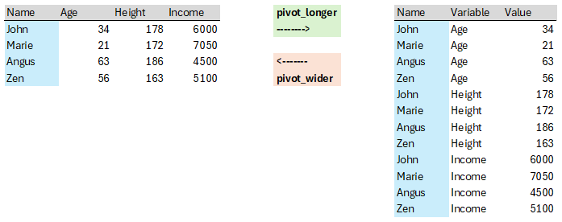

```{r setup, include = FALSE}
knitr::opts_chunk$set(echo = TRUE, warning = FALSE, message = FALSE)
library(webexercises)
```

## Introduction

Here we will go through the basics of looping in R.

Let's start by loading some packages we will use.

```{r}
library(tidyverse)
library(ggplot2)# to produce plots
library(pdfetch) # to access time series data from a database
library(xts)  # to deal with time-series data

```
## A toy loop

Loops are an incredibly useful programming tool that is used when the same computational action is to be repeated with inputs that change in a systematic manner. As this may be a little abstract, let's use some examples

Let's start with a very simple example to explain how loops work. 

```{r}
n <- 7

for (i in 1:n){
  print(i)
}
```

You can see that we defined a variable `n <- 7` and then we ran a loop where the index variable of the loop (here `i`) goes from 1 to `n`. And then inside the loop (everything inside the curly brackets `{ }`) something happens, using the current value of `i`. In this particular loop what happens is very boring, we just print the value of `i`.

Let's create a loop that sums up all the numbers between 1 and `n`. Let's set `n` to 100. We also need to set up a new variable before we start the loop `ns <- 0` to which we keep summing the numbers as we run through the loop. You get it right if you figure out that the sum of all numbers from 1 to 100 is 5050.


```{r,  webex.hide="Click here to see the solution"}
n <- 100
sn <- 0

for (i in 1:n){
  sn <- sn + i
}

print(sn)

```

Turns out that using a loop to calculate this is a bit of a sledgehammer. There is a formula that calculates this, $n(n + 1)/2$. Legend has it that the discovery of this formula was the first sign of 
[Carl-Friedrich Gauss'](https://www.nctm.org/Publications/TCM-blog/Blog/The-Story-of-Gauss) genius.

## Real problems solved with loops

Loops are useful in a number of real-life problems. Basically whenever you need to repeat the same actions with just slightly different input.

Let's get some real-life financial data to work on such a problem. We use the `pdfetch` package to download weekly stock price data for Apple (`AAPL`), Microsoft (`MSFT`) and the Dow Jones Index (`^DJI`).

```{r}
data_all <- pdfetch_YAHOO(c("AAPL","MSFT", "^DJI"), fields = "adjclose", interval = "1w", to = "2024-08-31")
```

Now we calculate weekly (log) returns for these. To do this we calculate logs (e.g. `log(data_all$AAPL)`) and then we take the logarithm (`log( )`). This is a standard way of calculating returns in finance. 

```{r}
data_all$AAPL.ret <- diff(log(data_all$AAPL))
data_all$MSFT.ret <- diff(log(data_all$MSFT))
data_all$DJI.ret <- diff(log(data_all$X.DJI)) # note the name of the DJI series in data_all
```

Let's have a look at one of these return series.

```{r}
plot(data_all$AAPL.ret)
```

As you can see there seem to be periods in which the weekly returns are more and others in which they are less volatile. You could investigate this by calculating rolling return variances. Say you pick the first 52 weeks of data and calculate the variance, then you pick weeks 2 to 53 to calculate the next variance and so forth until you use the last 52 available weeks to calculate the last rolling variance.

Let's do that for the three assets for which we have data. `data_all` has `r dim(data_all)[1]` rows. However, the first row has no returns. Hence there are only `r dim(data_all)[1]-1` rows of returns (in rows 2 to `r dim(data_all)[1]` of `data_all`). This then means that we will use rows 2 to 53 for the first variance calculation. The following table illustrates the scheme.

No | rows used
- | ----------
1 | 2 to 53
2 | 3 to 54
3 | 4 to 55
... | ...
n | `r dim(data_all)[1]-51` to `r dim(data_all)[1]`

How many rolling (52 week) variances can be calculated?

`n =` `r fitb(dim(data_all)[1]-52)`

Before you run through the loop you will have to think about storing the results. We have established that we will calculate `r dim(data_all)[1]-52` rolling variances. And we do this for all three assets. We therefore define a dataframe with `r `dim(data_all)[1]-52` rows, a `Date` variable and three additional variables into which we save the resuts (`save_var`).

```{r}
n <- dim(data_all)[1]-52

# Date picks the dates 
save_var <- data.frame(Date = index(data_all)[53:dim(data_all)[1]],
                        var.AAPL = NA,
                        var.MSFT = NA,
                        var.DJI = NA)

for(i in (1:n)){
  var_AAPL <- var(data_all$AAPL.ret[(1+i):(52+i)])
  var_MSFT <- var(data_all$MSFT.ret[(1+i):(52+i)])
  var_DJI <- var(data_all$DJI.ret[(1+i):(52+i)])
  save_var$var.AAPL[i] <- var_AAPL
  save_var$var.MSFT[i] <- var_MSFT
  save_var$var.DJI[i] <- var_DJI
}

```


`r hide("How was the Date variable created?")`

The date variable was created with the following command: `index(data_all)[53:dim(data_all)[1]]`. It may not be immediately obvious what this did. The object `data_all` is a time series (`xts`) project. R understands that the data are time-series data. When you call `index` of a time series object you get the series of dates for the observations. But you get a list of dates for all observations. The first variance we calculate is for the period represented by weeks 2 to 53. We therefore start with the 53rd observations and select all dates up to the last observation, `dim(data_all)[1]`. Type `dim(data_all)[1]` into the console to understand what this does. You may also want to consult the help function `?dim` from the Console.

`r unhide()`

To plot the time varying variances we turn the `save_var` data frame into a long dataframe.

```{r}
save_var.long <- save_var %>% pivot_longer(cols = c("var.AAPL", "var.MSFT", "var.DJI"), 
                                           names_to = "ticker",
                                           values_to = "var")

p1 <- ggplot(save_var.long, aes(x = Date, y = var, colour = ticker)) +
  geom_line(size = 1)
p1
```


`r hide("What does pivot_longer do?")`

The following image illustrates how the same data can be represented in two different tables. 



`pivot_wider` and `pivot_longer` are two tidyverse functions that can transform dataframes from one form into the other. All you need to know is that these functions exist. When you need them you will find help to understand how to use them. It turns out that `ggplot`s work best with data in the long format which is why we turn save_var into a long format.

`r unhide()`

You can see from this plot that for most parts of the sample period the Dow Jones Index (DJI) was the least risky asset to hold. Any finance student will recognise this as the benefits of diversification.

## Extension

In Finance the systematic (or market) risk of an asset A is described by the slope coefficient ($\beta_A$) in the following regression model.

\begin{equation}
r_{At} = \alpha_A + \beta_A r_{Mt}  + u_t 
\end{equation}

where $r_{At}$ and $r_{Mt}$ are the returns of asset A and the market returns respectively. It is recognised that this risk can change through time and therefore the $\beta_A$ coefficient is often calculated on moving time windows, just as we calculated the variances earlier on a 52-week moving window. In this context the above regression model is often called the Market model.

Write a loop in which you calculate the systematic risk for Apple and Microsoft. Use the same weekly data and 52 week windows as above. Replace the `XXXX` values in the code below to complete the loop.

```{r, eval = FALSE}

n <- dim(data_all)[XXXX]-XXXX

save_beta <- XXXX.XXXX(Date = index(data_all)[53:dim(data_all)[1]],
                        beta.AAPL = NA,
                        beta.MSFT = NA)

for(i in (XXXX:XXXX)){
  MM_AAPL <- lm(AAPL.ret ~ DJI.ret, data = data_all[(1+i):(52+i),])
  MM_MSFT <- XXXX(XXXX ~ DJI.ret, data = XXXX[(1+i):(52+i),])
  
  XXXX$beta.AAPL[i] <- MM_AAPL$coefficients[2]
  XXXX$beta.MSFT[i] <- MM_MSFT$XXXX[XXXX]
  
}

```


```{r, echo = FALSE}
n <- dim(data_all)[1]-52

save_beta <- data.frame(Date = index(data_all)[53:dim(data_all)[1]],
                        beta.AAPL = NA,
                        beta.MSFT = NA)

for(i in (1:n)){
  MM_AAPL <- lm(AAPL.ret ~ DJI.ret, data = data_all[(1+i):(52+i),])
  MM_MSFT <- lm(MSFT.ret ~ DJI.ret, data = data_all[(1+i):(52+i),])
  
  save_beta$beta.AAPL[i] <- MM_AAPL$coefficients[2]
  save_beta$beta.MSFT[i] <- MM_MSFT$coefficients[2]
  
}

```


Once the coefficients $\beta_{AAPL}$ and $\beta_{MSFT}$ are saved in `save_beta` we can plot these to see how they change.

```{r}

save_beta.long <- save_beta %>% pivot_longer(cols = c("beta.AAPL", "beta.MSFT"), 
                                           names_to = "ticker",
                                           values_to = "beta")

p2 <- ggplot(save_beta.long, aes(x = Date, y = beta, colour = ticker)) +
  geom_line(size = 1)
p2
```

From this plot you can see that $\beta_{MSFT}$ remains below the value of 1. Systematic (market) risk measures indicate that an asset tends to react less than the market itself to market variations.

## Summary

In this exercise we went through the mechanics of programming a loop. Here we applied it to calculating time-varying variances and measures of financial market risk.

But loops can be used for many other reasons. You may have dozens of datafiles which are all structured in the same way. A loop can then be used to import the data in these files. Or you have a database with many customer interactions. You could then write a loop to write customer specific reports for all customers in the database.

There are other ways in which you can repeat actions in a code. Most notably there are `while` loops. They differ from `for` loops in that it is not pre-determined how often a loop is repeated. `for` loops are much more common in econometric computing and hence it is the only one covered in this introduction.
