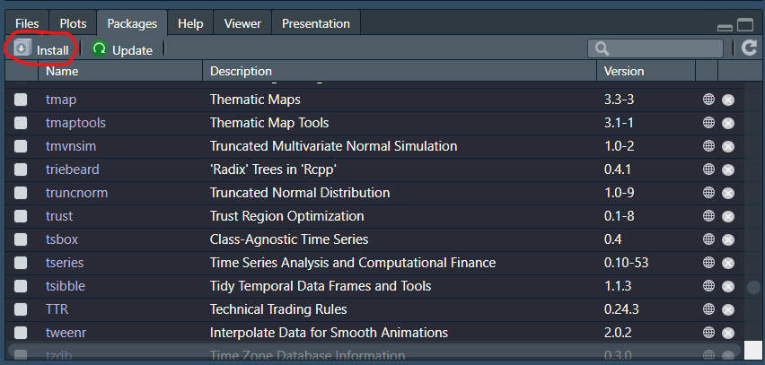
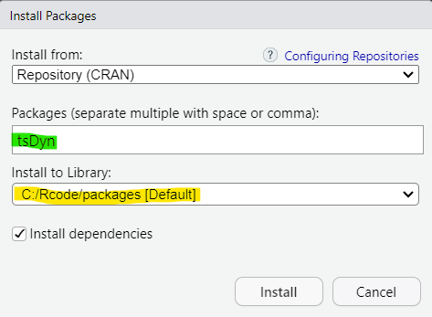

```{r setup, include=FALSE}
knitr::opts_chunk$set(echo = TRUE, warning = FALSE)
```

# Introduction

Here you will learn what packages are and how to use them. R is an open source software and provides a lot of functionality. But as it is an open source software it is designed such that people can add functionality to the basic functionality. You will find that you will almost always use such extra functionality. This is delivered through packages.

There are packages for easy data manipulation (`tidyverse`), for producing nice graphics (`ggplot2`), for loading data from a variety of data formats (`haven`) and for many other specific purposes. Each package includes a collection of functions which can eventually be used like any function in R. 

To use these functions you will have to do the following. Identify which package will help you in your project, find the package and download it to your computer. All of this you will only have to do once. But then you will have to load the package everytime you wish to actually use it in a project.


# Which package and where to find it

When you know that you wish to do a particular type of analysis, say estimate a vector error-correction model (VECM), you will first have to identify which package will support this best. In fact there will be many packages that will estimate VECM models. A good starting point is to go to your favorite internet search engine and search for something like "R estimating VECM which package". You will find links to resources that will not only point you to particular packages but quite likely also to some sources that help you with the implementation. For VECM you will quickly find that `tsDyn` is a package that supports this. 

Another excellent starting point is the consult [CRAN](https://cran.r-project.org/). CRAN stands for "The Comprehensive R Archive Network" and is a place where most useful R packages are stored and can be dowmloaded from. On that webpage you will find the incredibly useful "Task Views". These are short articles that introduce useful packages for a large number of areas such as databases, econometrics, finance and many more. One of them is called "Time Series" in which you will find links to useful packages for time series modelling and you will find that this also points to `tsDyn`.


# Download and install packages

Now that you know which package you want, you need to download and install it to your computer. This only needs to be done once. But if you work on different computers you may have to do that multiple times. Some very common packages are actually already downloaded automatically, so it is worth checking whether the package is already installed. Find the Packages tab in your RStudio interface. Here you will find a list of packages already installed. 

{width=50%}

As there is no `tsDyn` package you will need to download and install it. Downloading and installing is, in R, one step. You can click on the "install" button and then type the name of the package you wish to install (see green highlight). You can see that the default is that RStudio looks for the package in CRAN.

{width=40%}

You then click install. 

An alternative is to use a command line in the  Console

```{r, eval = FALSE}
install.packages("tsDyn")
```

After pressing the "install" button above or after executing the command line you will see a good number of output lines scrolling through the Console. At the end you should see something like the following:

{width=50%}

You can see that RStudio has not only downloaded the `tsDyn` package, but also other packages like the `foreach` and `vars` package. They are called dependencies. Packages that are used by the `tsDyn` package and if they are not already installed, RStudio will install them automatically.


# Load packages

Once a package is installed you can use it. So lets say you are writing your script file with your code. It is good practice to start your scriptfile not only with setting your working directory but also by loading all packes that are being used in your script. This is done using the `library` function.

```{r, eval = FALSE}
setwd("PATH TO YOUR WORKING DIRECTORY")

library(tidyverse)  # package for datahandling
library(ggplot2)    # package for graphics
library(tsDyn)      # package for TS modelling incl. VECM

```

Should you get an error message like "Error in library(ggplot2) : there is no package called ‘ggplot2’", then  R is telling you that you have not yet installed the `ggplot2` package.

Now you are really in a position to use the functionality of the `tsDyn` package. For instance the `VECM` function which allows you to estimate a vector error correction model. Use `?VECM` to see the help function. 

# Summary

Using packages is really a core skill for any R user. Most of the functionality you will use as a data analyst or econometrician will come through packages. Most packages are available from CRAN but sometimes you may have to install a package from github. Typically you will then be given instructions of how to install the package. 